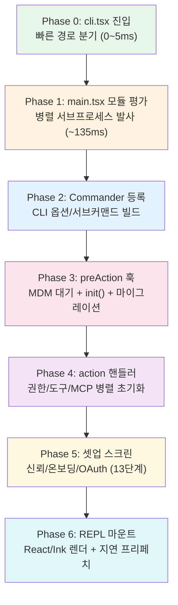
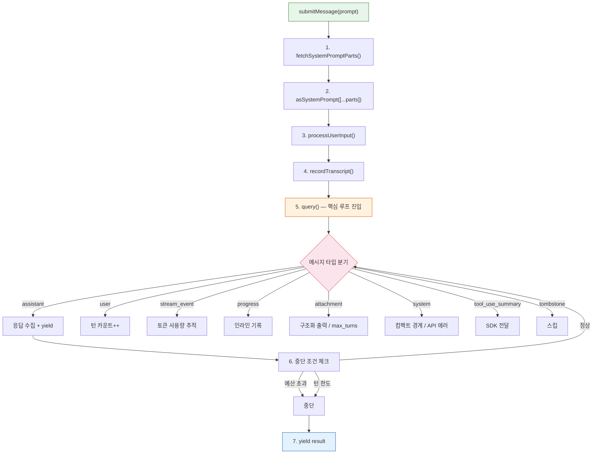
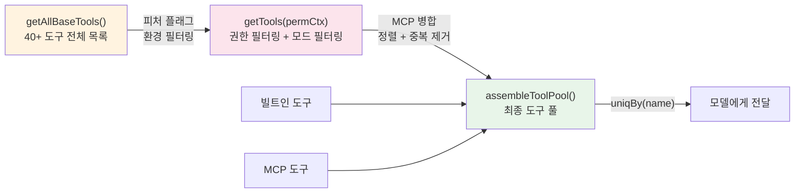
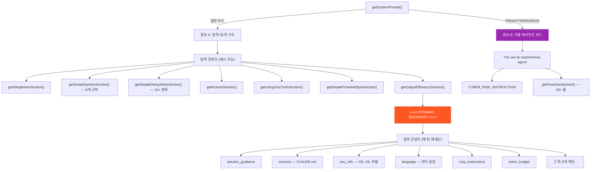
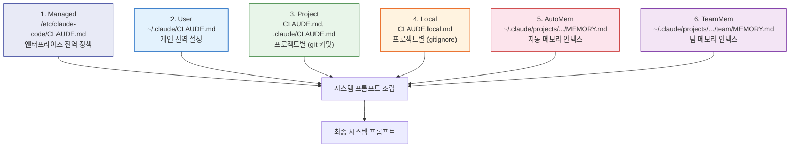
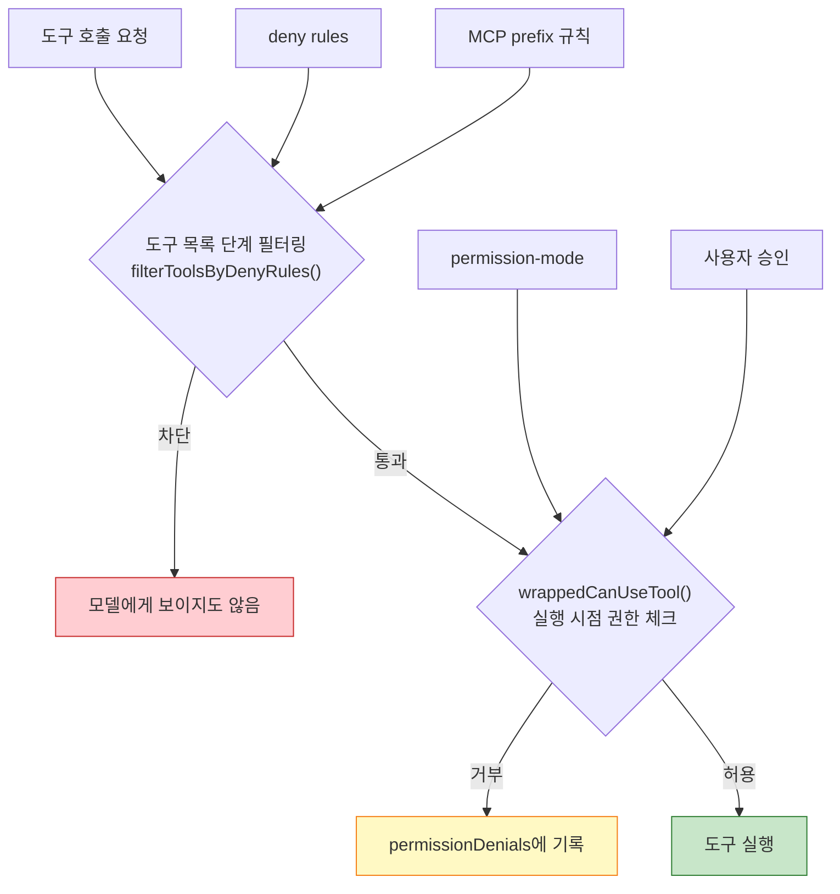

# Report 1: 해부도 (Anatomy)

> **"당신이 터미널에 한 줄을 치는 동안, 46,000줄의 엔진이 숨을 쉬고 있었습니다."**

---

## 들어가며

Claude Code를 사용해본 사람이라면 누구나 안다. 터미널에 질문을 던지면 답이 돌아온다. 파일을 읽고, 코드를 고치고, 테스트를 돌린다. 그런데 그 "사이"에서 무슨 일이 벌어지는지 아는 사람은 거의 없다.

유출된 소스맵 512,000줄을 펼쳐보니, 우리가 알던 "CLI 채팅 도구"는 빙산의 일각이었다. 수면 아래에는 1,297줄짜리 비동기 제너레이터 심장, 915줄짜리 신경계, 40개 이상의 도구 팩토리, 6계층 메모리 시스템, 그리고 7단계로 정밀하게 조율된 부팅 시퀀스가 숨어 있었다.

이 보고서는 Claude Code의 **L1 Surface**(수면 위)와 **L2 Engine**(수면 아래 첫 번째 계층)을 해부한다. 심장부터 외골격까지, 하나의 질문이 답이 되기까지의 전체 여정을 따라간다.

---

## 1.1 진입점 — `cli.tsx`에서 REPL까지, 7단계 부팅 파이프라인

### 첫 번째 줄이 실행되기까지

`claude`를 터미널에 치는 순간, 실행되는 코드는 `src/entrypoints/cli.tsx`다. 약 300줄짜리 이 파일의 역할은 단 하나 — **최대한 빨리 분기하는 것**이다.

```typescript
// src/entrypoints/cli.tsx
async function main(): Promise<void> {
  const args = process.argv.slice(2);

  // 빠른 경로 1: --version — import 0개
  if (args[0] === '--version') {
    console.log(`${MACRO.VERSION} (Claude Code)`);
    return;
  }

  // 빠른 경로 2~12: 각각 필요한 모듈만 동적 import
  // ...

  // 어디에도 해당하지 않으면 → 풀 CLI 로드
  startCapturingEarlyInput();
  const { main: cliMain } = await import('../main.js');  // ~135ms
  await cliMain();
}
```

놀라운 것은 "빠른 경로"가 **12개**나 존재한다는 점이다. `--version`은 모듈 로딩이 0개, `--daemon-worker`는 데몬 모듈만, `bridge`는 인증+브릿지만 로드한다. 모든 경로가 **동적 import**를 사용해 필요한 코드만 메모리에 올린다.

### 7단계 부팅 파이프라인

빠른 경로에 해당하지 않는 일반 실행은 7단계 파이프라인을 거친다:



### Phase 1의 비밀 — 서브프로세스 선제 발사

알고 보니, `main.tsx`의 **import 구문 사이에** 이미 운영체제 수준의 최적화가 실행되고 있었다. 130개 이상의 import 평가에 ~135ms가 걸리는데, 이 시간을 낭비하지 않기 위해 **세 가지 사이드이펙트**가 모듈 평가 시점에 발사된다:

| 서브프로세스 | 플랫폼 | 소요시간 | 병렬 대상 |
|---|---|---|---|
| `plutil` (plist → JSON) | macOS | ~30ms | import 평가 |
| `reg query` (레지스트리) | Windows | ~30ms | import 평가 |
| `security find-generic-password` x 2 | macOS | ~32ms | import 평가 |

macOS 키체인에서 OAuth 토큰과 레거시 API 키를 **동시에** 읽는다. 기존에는 순차 동기 spawn으로 ~65ms 소요되던 작업이, 이 패턴으로 **추가 비용 0ms**가 되었다.

```typescript
// src/utils/secureStorage/keychainPrefetch.ts
export function startKeychainPrefetch(): void {
  if (process.platform !== 'darwin' || isBareMode()) return;
  const oauthSpawn = spawnSecurity('Claude Code-credentials');
  const legacySpawn = spawnSecurity('Claude Code');
  prefetchPromise = Promise.all([oauthSpawn, legacySpawn]).then(...)
}
```

### Phase 5 — 13단계 셋업 다이얼로그 체인

사용자가 처음 Claude Code를 실행하면, 온보딩 → 신뢰 다이얼로그 → GrowthBook 재초기화 → MCP 서버 승인 → CLAUDE.md 외부 include 경고 → 환경변수 적용 → 텔레메트리 → Grove 정책 → API 키 승인 → 권한 모드 경고 → 오토 모드 동의 → 채널 확인까지 **무려 13단계의 다이얼로그**를 거칠 수 있다.

**보안 게이트**: 이 스크린들이 끝나기 전에는 git 명령이 실행되지 않는다. Git hook을 통한 코드 실행 공격을 사전 차단하기 위해서다.

> **놀라운 포인트**: `-p` (print 모드) 플래그가 있으면 서브커맨드 등록을 **통째로 건너뛴다**. 이것만으로 ~65ms가 절약된다. "빠른 경로"에 대한 집착이 밀리초 단위까지 내려간다.

---

## 1.2 심장부 — QueryEngine, 1,297줄의 비동기 제너레이터

### 하나의 질문이 답이 되기까지

`src/QueryEngine.ts`. 1,297줄. Claude Code의 심장이다.

핵심은 단 하나의 메서드 — `submitMessage()`. 이것은 `AsyncGenerator<SDKMessage>`를 반환하는 비동기 제너레이터로, 사용자의 질문이 최종 답변이 될 때까지의 전체 생명주기를 관장한다.

```typescript
QueryEngine {
  config: QueryEngineConfig        // 도구, 명령, MCP, 모델, 예산
  mutableMessages: Message[]       // 대화 상태 (세션 간 유지)
  abortController: AbortController // 중단 제어
  permissionDenials: SDKPermissionDenial[]  // 거부 추적
  totalUsage: NonNullableUsage     // 토큰 사용량 누적
  readFileState: FileStateCache    // 파일 읽기 캐시
  discoveredSkillNames: Set        // 턴별 스킬 탐색 추적
}
```

### 실행 파이프라인 해부



### 5-Gate 예산 시스템

`query()` 루프 안에서 매 턴마다 **5개의 게이트**가 열려야 다음 턴으로 진행된다:

1. **maxBudgetUsd** — 달러 기준 비용 한도 초과 여부
2. **maxTurns** — 최대 턴 수 도달 여부
3. **structured output 재시도 한도** — 구조화 출력 실패 횟수
4. **abortController.signal** — 외부 중단 신호
5. **tombstone** — 메시지 제거 신호 (스킵)

### 메시지 루프의 7가지 얼굴

`for await (message of query(...))` — 이 한 줄 뒤에 **7가지 메시지 타입** 분기가 숨어 있다 (L675-1049):

| 메시지 타입 | 처리 내용 |
|---|---|
| `tombstone` | 스킵 (메시지 제거 신호) |
| `assistant` | `mutableMessages`에 push + yield 정규화 |
| `user` | 턴 카운트 증가 |
| `stream_event` | `message_start` → 사용량 리셋, `message_delta` → 사용량 업데이트, `message_stop` → 누적 |
| `progress` | 인라인 기록 (resume 정합성 보장) |
| `attachment` | 구조화 출력 캡처 / max_turns 도달 시 즉시 return |
| `system` | 스닙 경계 → snipReplay 실행, 컴팩트 경계 → GC, API 에러 → 재시도 |

### 세션 영속화 — 죽어도 잃지 않는다

QueryEngine의 세션 영속화 전략은 **방어적 비대칭**이다:

- **유저 메시지**: 쿼리 루프 진입 **전** 즉시 기록 (프로세스 킬 대비)
- **어시스턴트 메시지**: Fire-and-forget (성능 우선)
- **컴팩트 경계**: 즉시 기록 + 이전 메시지 GC
- **EAGER_FLUSH**: Cowork/데스크톱 앱에서는 즉시 flush

유저가 입력한 순간, 그 메시지는 **프로세스가 죽어도** 살아남도록 설계되어 있다.

### Feature-Gated 조건부 임포트

QueryEngine은 피처 플래그(`COORDINATOR_MODE`, `HISTORY_SNIP`)에 따라 코드 자체가 달라진다. `feature()` 호출은 빌드 타임에 esbuild가 평가하므로, false인 분기의 코드는 외부 빌드에서 **물리적으로 존재하지 않는다**.

> **놀라운 포인트**: 모든 도구 호출은 `wrappedCanUseTool`을 거친다. 이 래퍼는 `canUseTool` 호출 결과가 `allow`가 아니면 거부 내역을 `permissionDenials` 배열에 축적한다. 즉, Claude Code는 "거부당한 시도"까지 모두 기록하고 있다.

---

## 1.3 손과 발 — 40개 이상의 도구, 3단계 조립 파이프라인

### 도구 인벤토리: 생각보다 훨씬 많다

사용자가 보는 도구는 `Read`, `Edit`, `Bash` 같은 익숙한 이름들이다. 하지만 내부에는 **40개 이상의 도구**가 존재하며, 상당수는 피처 플래그 뒤에 숨어 있다.

**항상 활성 — 핵심 16개:**

| 도구 | 역할 |
|---|---|
| `AgentTool` | 서브에이전트 생성 |
| `BashTool` | 셸 명령 실행 |
| `FileReadTool` | 파일 읽기 |
| `FileEditTool` | 파일 편집 (diff 기반) |
| `FileWriteTool` | 파일 쓰기 (전체) |
| `GlobTool` | 파일 패턴 검색 |
| `GrepTool` | 내용 검색 (ripgrep 기반) |
| `NotebookEditTool` | Jupyter 노트북 편집 |
| `WebFetchTool` | URL 페치 |
| `WebSearchTool` | 웹 검색 |
| `TodoWriteTool` | TODO 관리 |
| `TaskOutputTool` | 태스크 출력 읽기 |
| `TaskStopTool` | 태스크 중지 |
| `AskUserQuestionTool` | 사용자에게 질문 |
| `SkillTool` | 스킬 호출 |
| `BriefTool` | Brief 모드 전환 |

**조건부 활성 — 피처 플래그 게이팅:**

| 도구 | 조건 | 한 줄 설명 |
|---|---|---|
| `SleepTool` | PROACTIVE/KAIROS | 자율 에이전트 대기 |
| `CronCreate/Delete/ListTool` | AGENT_TRIGGERS | 크론 스케줄링 |
| `RemoteTriggerTool` | AGENT_TRIGGERS_REMOTE | 원격 트리거 |
| `MonitorTool` | MONITOR_TOOL | 프로세스 모니터링 |
| `SendUserFileTool` | KAIROS | 파일 전송 |
| `PushNotificationTool` | KAIROS | 푸시 알림 |
| `SubscribePRTool` | KAIROS_GITHUB_WEBHOOKS | PR 웹훅 구독 |
| `WebBrowserTool` | WEB_BROWSER_TOOL | 브라우저 도구 |
| `SnipTool` | HISTORY_SNIP | 히스토리 스닙 |
| `TeamCreateTool` | agentSwarmsEnabled | 팀 생성 |
| `TeamDeleteTool` | agentSwarmsEnabled | 팀 삭제 |
| `SendMessageTool` | 항상 (lazy import) | 에이전트 간 메시지 |

**ant-only (내부 전용):**

| 도구 | 역할 |
|---|---|
| `REPLTool` | REPL VM 안에서 Bash/Read/Edit 래핑 |
| `SuggestBackgroundPRTool` | 백그라운드 PR 제안 |
| `ConfigTool` | 설정 관리 |
| `TungstenTool` | 미공개 시스템 |

### 3단계 도구 조립 파이프라인

도구가 모델에게 전달되기까지 **3단계 파이프라인**을 거친다:



`assembleToolPool()`의 설계에는 놀라운 디테일이 있다:

- **빌트인 > MCP**: `uniqBy`로 이름 기준 중복 제거 시 빌트인이 우선
- **빌트인 연속 배치**: 빌트인 도구를 앞쪽에 연속으로 배치하여 **프롬프트 캐시 안정성** 확보
- **MCP가 빌트인 사이에 끼면?** 캐시 키가 무효화된다 — 이를 방지하기 위한 의도적 설계
- **`byName` 정렬**: 결정론적 순서 보장

### Dead Code Elimination (DCE) 패턴

외부 빌드에서 불필요한 도구 코드를 물리적으로 제거하는 세 가지 패턴:

```typescript
// 패턴 1: 피처 플래그 게이팅 (빌드 타임 평가 → 코드 제거)
const SleepTool = feature('PROACTIVE') || feature('KAIROS')
  ? require('./tools/SleepTool/SleepTool.js').SleepTool
  : null

// 패턴 2: 환경 변수 게이팅 (빌드 타임 --define)
const REPLTool = process.env.USER_TYPE === 'ant'
  ? require('./tools/REPLTool/REPLTool.js').REPLTool
  : null

// 패턴 3: Lazy require (순환 의존성 방지)
const getTeamCreateTool = () =>
  require('./tools/TeamCreateTool/TeamCreateTool.js').TeamCreateTool
```

`feature()` 호출은 esbuild가 **컴파일 타임에** `true`/`false`로 치환한다. `false` 분기의 `require()`는 **번들에서 완전히 제거**된다. 외부 사용자의 Claude Code에는 `SleepTool`, `REPLTool`, `TungstenTool` 등의 코드가 **물리적으로 존재하지 않는다**.

### 도구 지연 로딩 — ToolSearchTool

MCP 서버가 많은 도구를 제공하면, 모든 도구를 시스템 프롬프트에 넣는 대신 **검색 기반 지연 로딩**이 활성화된다:

```typescript
...(isToolSearchEnabledOptimistic() ? [ToolSearchTool] : []),
```

모델은 `select:tool_name` 또는 키워드 검색으로 필요한 도구만 로드한다. 토큰 절감과 캐시 안정성을 동시에 잡는 전략이다.

### 임베디드 검색 도구 — Ant 내부의 비밀 무기

Anthropic 내부 빌드에서는 `bfs`(faster find)와 `ugrep`(faster grep)이 **Bun 바이너리에 직접 임베드**된다. 셸의 `find`/`grep`이 자동 alias되므로 별도 Glob/Grep 도구가 불필요하다. 외부 빌드에서만 전용 도구가 포함된다.

> **놀라운 포인트**: `ToolUseContext`는 **40개 이상의 필드**를 가진 거대한 실행 컨텍스트 객체다. `contentReplacementState`(도구 결과 크기 예산 관리), `renderedSystemPrompt`(포크 서브에이전트의 프롬프트 캐시 공유), `updateAttributionState`(파일 변경 추적) 등 — 단순한 "도구 호출"이 아니라 하나의 **실행 환경 전체**를 전달하는 구조다.

---

## 1.4 신경계 — 시스템 프롬프트 빌더, 915줄의 지령서

### 보이지 않는 지시문

`src/constants/prompts.ts`. 915줄. 모델이 "어떻게 행동해야 하는지"를 정의하는 **두뇌의 신경계**다.

사용자가 보는 것은 모델의 응답뿐이지만, 그 응답을 결정하는 것은 이 915줄의 시스템 프롬프트다. 그리고 알고 보니, 이 프롬프트에는 **두 가지 완전히 다른 경로**가 존재했다.

### 이중 경로 시스템



### 정적/동적 캐시 경계 — 숨겨진 최적화

```typescript
export const SYSTEM_PROMPT_DYNAMIC_BOUNDARY =
  '__SYSTEM_PROMPT_DYNAMIC_BOUNDARY__'
```

이 한 줄의 상수가 **수백만 API 호출의 비용**을 절감한다:

- **경계 이전 (정적)**: 모든 조직에 공통 → `cacheScope: 'global'`로 캐시
- **경계 이후 (동적)**: 세션/사용자별 → 캐시 안 됨

조건부 분기가 경계 **이전**에 오면 캐시 해시의 변종이 2^N으로 폭발한다. 실제로 PR #24490과 #24171에서 이 버그가 발생했다고 코드 주석에 기록되어 있다.

### 동적 섹션 레지스트리 — 15개 이상의 실시간 조각

동적 경계 뒤에 조립되는 섹션은 **레지스트리 패턴**으로 관리된다:

```typescript
// 캐시 안전: 동일 입력 → 동일 출력
systemPromptSection('name', () => computeSection())

// 캐시 위험: 매 턴 재계산 (명시적 이유 필수)
DANGEROUS_uncachedSystemPromptSection('name', () => compute(), 'reason')
```

`DANGEROUS_` 접두사가 붙은 섹션은 **프롬프트 캐시를 무효화할 수 있는** 위험 요소다. MCP instructions가 대표적 — 서버 연결/해제가 턴 사이에 발생하므로 매번 재계산해야 한다.

확인된 동적 섹션은 **15개 이상**: `session_guidance`, `memory`, `ant_model_override`, `env_info_simple`, `language`, `output_style`, `mcp_instructions`(DANGEROUS), `scratchpad`, `frc`, `summarize_tool_results`, `token_budget`, `brief`, `numeric_length_anchors`(ant-only), `verification_agent`, `coordinator_context` 등이다.

### ANT-ONLY 섹션 — 외부에서는 보이지 않는 지시문

`process.env.USER_TYPE === 'ant'`로 게이팅된 내부 전용 프롬프트가 여러 개 있다: 과잉 코멘트 억제(Capy v8), assertiveness 보정, 결과 정직 보고(False claims 29-30% → 16.7% 감소), 25단어/100단어 제한(1.2% 토큰 절감), 산문체 커뮤니케이션 스타일 등. 외부 빌드에서 이 코드들은 DCE로 **물리적으로 제거**된다.

### Undercover 모드와 검증 에이전트

두 가지 더 놀라운 메커니즘이 있다. **Undercover 모드** — `isUndercover()`가 true이면 모델명, ID, 지식 컷오프까지 시스템 프롬프트에서 **완전히 제거**한다. 미공개 모델 테스트 시 정보 누출을 방지하기 위해서다.

**검증 에이전트** — 3개 이상의 파일 편집이나 인프라 변경이 감지되면 **독립적 적대적 검증 에이전트**가 FAIL/PASS/PARTIAL을 판정한다. 자기 검증은 불가능하다.

> **놀라운 포인트**: 시스템 프롬프트에 숨겨진 모델 상수에 따르면, 최신 프론티어 모델은 `Claude Opus 4.6` (ID: `claude-opus-4-6`, 지식 컷오프: May 2025)이며, `claude-sonnet-4-6`의 컷오프는 August 2025로 기록되어 있다.

---

## 1.5 기억 — CLAUDE.md 6계층과 4가지 컴팩션 전략

### 6계층 메모리 계층 구조

Claude Code의 메모리 시스템은 단순한 "대화 기록"이 아니다. 6개 계층으로 구성된 **정교한 지식 관리 시스템**이다:



뒤에 로딩될수록 높은 우선순위를 가진다. 즉, TeamMem이 Managed를 override할 수 있다.

**주요 메커니즘:**

- **`@include` 지시어**: `@./path`, `@~/path`, `@/absolute/path` 문법으로 외부 파일 포함
- **최대 깊이**: `MAX_INCLUDE_DEPTH = 5` (무한 재귀 방지)
- **조건부 규칙**: frontmatter의 `paths:` 필드로 특정 파일/글로브에만 적용
- **최대 크기**: `MAX_MEMORY_CHARACTER_COUNT = 40,000`자
- **HTML 주석 제거**: `<!-- ... -->` 블록 자동 스트립

**보안 제약**: 프로젝트 설정의 `autoMemoryDirectory`는 무시된다. 악성 레포가 메모리 디렉토리를 `~/.ssh`로 리디렉션하는 공격을 사전 차단하기 위해서다.

### 자동 메모리 추출 — 백그라운드에서 학습하는 에이전트

매 턴이 끝날 때마다 **백그라운드에서 포크된 에이전트**가 대화를 분석하여 기억을 추출한다:

```
initExtractMemories() → executeExtractMemories()
  ├── 진입 조건: 메인 에이전트만, 원격 아님, 플래그 활성
  ├── scanMemoryFiles() → 기존 메모리 매니페스트 생성
  ├── runForkedAgent() → 메인 대화의 perfect fork
  │   ├── 도구: Read/Grep/Glob + 읽기전용 Bash + 메모리 디렉토리 Write/Edit
  │   ├── maxTurns: 5
  │   └── querySource: 'extract_memories'
  └── 결과: 추출된 기억을 파일로 저장
```

추출된 기억은 **4가지 타입**으로 분류된다:

| 타입 | 설명 | 팀 공유 |
|---|---|---|
| `user` | 사용자 역할, 목표, 전문성 | 항상 비공개 |
| `feedback` | 작업 방식 교정/확인 지침 | 기본 비공개, 프로젝트 컨벤션이면 팀 |
| `project` | 진행 중인 작업, 목표, 버그 | 팀 공유 편향 |
| `reference` | 외부 시스템 포인터 (Linear, Grafana 등) | 보통 팀 공유 |

### 메모리 회상 — Sonnet이 골라주는 관련 기억

새 쿼리가 들어오면, 저장된 기억들 중 **관련있는 것만 골라서** 컨텍스트에 주입한다:

1. `scanMemoryFiles()` — 디렉토리 스캔, 최대 **200개** 파일, mtime 기준 정렬
2. 이전 턴에서 이미 표시된 파일 제외
3. **Sonnet sideQuery** — 경량 모델이 쿼리와 기억 매니페스트를 비교하여 **최대 5개** 선별
4. 선별된 기억을 메인 모델 컨텍스트에 주입

메모리 신선도 시스템도 있다 — 2일 이상 지난 기억에는 `"This memory is {d} days old"` 경고가 자동 추가된다.

### MEMORY.md 인덱스 — 200줄, 25KB의 벽

```typescript
export const MAX_ENTRYPOINT_LINES = 200
export const MAX_ENTRYPOINT_BYTES = 25_000
```

MEMORY.md 인덱스는 200줄 또는 25KB를 초과하면 **강제 절단**된다. 절단 시 경고 메시지가 자동 추가된다. 인덱스는 포인터 전용 — 한 줄에 ~150자, 직접 내용 작성 금지.

### 4가지 컴팩션 전략

대화가 길어지면 컨텍스트 윈도우 한계에 부딪힌다. Claude Code는 **4개의 독립적 컴팩션 메커니즘**을 계층적으로 운용한다:

#### 전략 1: Microcompact (도구 결과 정리)

가장 가벼운 정리. 오래된 도구 결과의 content를 `'[Old tool result content cleared]'`로 교체한다.

- **시간 기반**: 마지막 assistant 메시지 이후 N분 경과 시 발동
- **캐시 기반 (ant-only)**: `cache_edits` API로 서버 캐시에서만 삭제
- **대상 도구**: FileRead, Bash, Grep, Glob, WebSearch, WebFetch, FileEdit, FileWrite

#### 전략 2: Session Memory Compact

세션 메모리 노트가 이미 요약 역할을 하므로, **LLM 호출 없이** 컴팩션을 수행한다.

```
보존 범위: minTokens(10,000) ~ maxTokens(40,000)
최소 메시지: 5개 텍스트 블록
```

핵심 장점은 **API 호출 비용이 0**이라는 것이다.

#### 전략 3: Legacy Compact (LLM 요약)

Sonnet으로 9-섹션 구조화 요약을 생성한다:

1. Primary Request
2. Key Technical Concepts
3. Files/Code
4. Errors/Fixes
5. Problem Solving
6. All User Messages
7. Pending Tasks
8. Current Work
9. Next Step

`<analysis>` 스크래치패드로 사고 → 제거 후 `<summary>`만 보존. 프롬프트 초과 시 최대 3회 재시도하며, 가장 오래된 API 라운드 그룹부터 제거한다.

#### 전략 4: Auto Compact (자동 트리거)

```typescript
// 트리거 조건
tokenCount >= effectiveContextWindow - 13,000  // AUTOCOMPACT_BUFFER_TOKENS
```

서킷 브레이커: 연속 3회 실패 시 자동 중단 (`MAX_CONSECUTIVE_AUTOCOMPACT_FAILURES = 3`)

실행 우선순위:
1. Session Memory Compact 먼저 시도 (API 호출 없음)
2. 실패 시 Legacy Compact로 폴백

> **놀라운 포인트**: 세션 메모리의 9-섹션 노트 템플릿 — Session Title, Current State, Task specification, Files and Functions, Workflow, Errors & Corrections, Codebase Documentation, Learnings, Key results, Worklog — 은 **섹션 제목 자체가 불변**이다. Edit 도구로 수정이 금지되어 있으며, 내용만 채울 수 있다. 이 구조화 덕분에 LLM 호출 없는 컴팩션이 가능하다.

---

## 1.6 외골격 — 권한 시스템 개관

### 모든 도구 호출은 검문소를 거친다

QueryEngine의 `wrappedCanUseTool`이 모든 도구 호출을 감싸고 있다는 것은 이미 살펴봤다. 하지만 이것은 빙산의 일각이다.

Claude Code의 권한 시스템은 **다중 계층**으로 구성된다:



**1단계 — 도구 목록 필터링**: 거부 규칙에 매칭되는 도구는 모델에게 **보이지도 않는다**. MCP 서버 prefix 규칙(`mcp__server`)으로 서버 전체 도구를 한 번에 차단할 수도 있다.

**2단계 — 실행 시점 권한 체크**: `canUseTool` 콜백이 `allow`/`deny`를 반환. 거부된 시도는 SDK 리포팅용으로 추적된다.

**3단계 — 디버거 차단**: `isBeingDebugged()`가 true이면 **즉시 종료**. Node.js 디버거를 통한 런타임 조작을 원천 차단한다.

```typescript
if (isBeingDebugged()) process.exit(1);
```

이 권한 시스템의 전모 — `--dangerously-skip-permissions` 플래그의 의미, `permission-mode`의 3가지 모드, 그리고 Anthropic이 "위험한 작업"을 어떻게 정의하는지 — 는 **Report 2: "감시탑"**에서 자세히 해부한다.

> **놀라운 포인트**: `--bare` 모드는 키체인 프리페치, CLAUDE.md 자동 탐색, 스킬, 훅, LSP, 플러그인 동기화, 커밋 어트리뷰션, 자동 메모리, 지연 프리페치 전체, UDS 메시징, 팀메이트 스냅샷 등을 **모두 건너뛴다**. 그러나 `--system-prompt`, `--add-dir`, `--mcp-config`, `--settings` 같은 명시적 설정은 여전히 작동한다. 극한의 성능이 필요한 스크립팅 시나리오를 위한 "뼈대만 남긴" 모드다.

---

## 마무리 — 심장이 뛰는 동안

이 보고서에서 해부한 것은 Claude Code의 해부학적 기초다. 7단계 부팅 파이프라인, 1,297줄의 비동기 제너레이터 심장, 40개 이상의 도구를 3단계로 조립하는 파이프라인, 915줄의 시스템 프롬프트 신경계, 6계층 메모리와 4가지 컴팩션 전략, 그리고 다중 계층 권한 외골격.

하지만 이것은 L1과 L2 — 수면 위와 바로 아래 계층에 불과하다. 이 심장이 뛰는 동안, 그 뒤에서 **28개의 피처 플래그**가 기능의 on/off를 제어하고, **GrowthBook**이 사용자마다 다른 경험을 설계하며, **OpenTelemetry 파이프라인**이 모든 것을 기록하고 있었다.

다음 보고서 **"감시탑"**에서는 L3 Control Layer로 내려간다 — Anthropic이 무엇을 보고, 무엇을 제어하는지, 그 전모를 드러낸다.

---

> *"당신이 Claude와 대화하는 동안, Claude도 당신을 보고 있었습니다."*
> *— Report 2: "감시탑"에서 계속*
