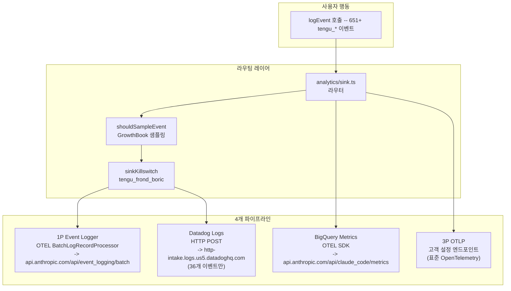
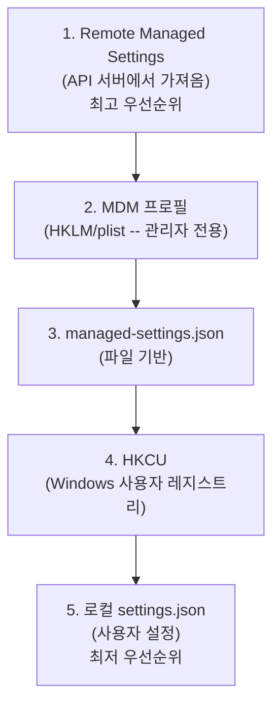
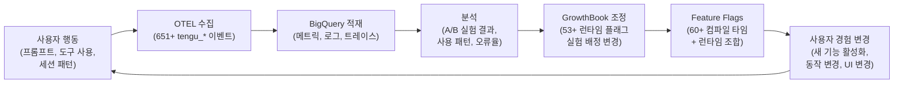

# Report 2: 감시탑 (Watchtower)

## "보이지 않는 눈" — Anthropic은 무엇을 보고 있는가

---

> *"당신이 Claude를 사용하는 동안, Claude도 당신을 보고 있었습니다."*

---

### 서문: 감시의 순환

당신이 터미널에 첫 번째 프롬프트를 입력하는 순간, 보이지 않는 시계가 돌기 시작한다.

Claude Code는 단순한 CLI 도구가 아니다. 그것은 **관찰하고, 보고하고, 적응하는 시스템**이다. 651개 이상의 텔레메트리 이벤트가 당신의 모든 행동을 기록하고, 53개 이상의 런타임 플래그가 실시간으로 당신의 경험을 조율하며, 엔터프라이즈 관리 시스템이 조직 단위로 기능을 제어한다. 그리고 그 모든 것 위에, 안티 디스틸레이션 방어막과 시크릿 스캐너가 조용히 작동한다.

Report 1 "해부도"에서 우리는 Claude Code의 내부 장기를 해부했다. 이제 Report 2에서는 그 장기들을 감시하고 제어하는 **신경계** — L3 Control Layer — 를 추적한다.

핵심 질문은 단 하나다: **Anthropic은 정확히 무엇을 보고 있으며, 무엇을 조작할 수 있는가?**

---

## 2.1 실험실 (The Laboratory) — GrowthBook A/B 테스트

### "모든 사용자가 같은 Claude Code를 쓰고 있다고 생각하십니까?"

Claude Code에는 **GrowthBook** 기반의 정교한 런타임 실험 시스템이 내장되어 있다. 이 시스템은 사용자마다 다른 기능을 보여주고, 다른 동작을 적용하며, 그 결과를 추적한다.

### 아키텍처

```
getGrowthBookClientKey()
    |
    +---> GrowthBook SDK (remoteEval: true)
    |         |
    |         +-- 서버: api.anthropic.com (인증된 remoteEval)
    |         +-- 캐시: ~/.claude.json -> cachedGrowthBookFeatures
    |         +-- 리프레시: 6시간 (외부) / 20분 (ant 내부)
    |
    +---> 오버라이드 경로 (내부 전용)
              +-- CLAUDE_INTERNAL_FC_OVERRIDES (환경변수)
              +-- /config Gates 탭 (로컬 설정)
```

### 사용자 타겟팅 속성

GrowthBook은 사용자를 실험 그룹에 배정하기 위해 다음 속성들을 수집한다:

| 속성 | 용도 |
|------|------|
| `deviceId` | 기기별 고유 식별 |
| `platform` (win32/darwin/linux) | OS별 실험 분기 |
| `organizationUUID` | 조직별 기능 롤아웃 |
| `subscriptionType` | 요금제별 차등 기능 |
| `rateLimitTier` | 사용량 계층별 조율 |
| `firstTokenTime` | 신규/기존 사용자 구분 |
| `email` | 내부 직원 식별 |
| `appVersion` | 버전별 점진 배포 |

이 속성들의 조합으로 Anthropic은 특정 조직의, 특정 OS를 쓰는, 특정 요금제의 사용자에게만 새 기능을 보여줄 수 있다.

### 53개+ 런타임 피처 플래그 (tengu_* 코드네임)

GrowthBook을 통해 운영되는 런타임 플래그는 **53개 이상**이다. 이들은 모두 `tengu_` 접두사와 난독화된 코드네임을 사용한다.

주요 플래그를 카테고리별로 정리하면:

| 카테고리 | 플래그 예시 | 설명 |
|----------|------------|------|
| **에이전트** | `tengu_amber_flint`, `tengu_amber_stoat` | 스웜 활성화, 빌트인 에이전트 |
| **메모리** | `tengu_coral_fern`, `tengu_passport_quail` | 메모리 디렉토리, 경로/추출 |
| **보안** | `tengu_birch_trellis` | Bash 권한 제어 |
| **UI** | `tengu_marble_sandcastle`, `tengu_willow_mode` | Fast 모드, Willow 모드 |
| **텔레메트리** | `tengu_trace_lantern` | 베타 트레이싱 허용 |
| **음성** | `tengu_amber_quartz_disabled` | 음성 모드 비상 킬스위치 |
| **원격** | `tengu_cobalt_harbor`, `tengu_cobalt_lantern` | 원격 세션 전제조건 |

### 실험 노출 추적

A/B 실험에 배정된 사용자가 해당 기능에 처음 접근하면, `logGrowthBookExperimentTo1P()` 함수가 호출되어 **1st Party 텔레메트리 파이프라인**으로 실험 노출 이벤트가 전송된다. 세션 내 중복은 `loggedExposures` Set으로 방지하고, SDK 초기화 전 접근은 `pendingExposures`에 저장했다가 초기화 후 일괄 전송한다.

### 읽기 우선순위 — 5단계 폴백 체인

```
1. 환경변수 오버라이드 (CLAUDE_INTERNAL_FC_OVERRIDES, ant 전용)
2. 로컬 설정 오버라이드 (growthBookOverrides, ant 전용)
3. 인메모리 remoteEvalFeatureValues (서버 평가 결과)
4. 디스크 캐시 (~/.claude.json -> cachedGrowthBookFeatures)
5. 기본값 (defaultValue 파라미터)
```

인터넷이 끊겨도 디스크 캐시가 남아 있으므로, **마지막으로 연결된 시점의 실험 배정이 유지**된다. GrowthBook은 이전 Statsig 시스템에서 마이그레이션 중이며, `checkStatsigFeatureGate_CACHED_MAY_BE_STALE` 같은 레거시 래퍼가 아직 남아 있다.

> **놀라운 포인트**: "tengu"(天狗)라는 코드네임은 일본 신화의 천구에서 따온 것이다. 651개의 이벤트가 모두 `tengu_` 접두사를 달고 있으며, 플래그 이름들은 `coral_fern`(산호고사리), `marble_sandcastle`(대리석 모래성) 같은 자연어 난독화를 사용한다. 누군가 소스를 보더라도 무엇을 제어하는지 즉시 알 수 없게 설계된 것이다.

---

## 2.2 관측소 (The Observatory) — 4-Layer 텔레메트리 파이프라인

### "651개의 눈"

Claude Code는 단일 텔레메트리 시스템이 아니다. **4개의 독립적 파이프라인**이 동시에 작동하여, 서로 다른 수준의 데이터를 서로 다른 목적지로 전송한다.



### 파이프라인 1: 1st Party Event Logging

모든 텔레메트리의 프라이머리 채널이다. OpenTelemetry SDK의 `BatchLogRecordProcessor`를 사용하여 이벤트를 배치 처리한다.

**배치 설정** (GrowthBook `tengu_1p_event_batch_config`로 원격 조정 가능):

| 설정 | 기본값 |
|------|--------|
| 전송 주기 | 10초 |
| 최대 배치 크기 | 200개 |
| 최대 큐 크기 | 8,192개 |
| 최대 재시도 | 8회 |
| 엔드포인트 | `api.anthropic.com/api/event_logging/batch` |

**실패 복원 메커니즘**: 전송 실패 시 `~/.claude/telemetry/` 디렉토리에 JSONL 파일로 저장하고, 2차 백오프 재시도(base * attempts^2, 최대 30초)를 수행한다. 8회 재시도 후에도 실패하면 드롭하지만, **다음 세션에서 이전 배치를 자동으로 재시도**한다. 데이터를 잃지 않겠다는 강한 의지가 보인다.

### 파이프라인 2: Datadog Logs

실시간 모니터링/알림용 서브셋 채널. 전체 651개 이벤트 중 **36개만** 전송한다.

Datadog으로 전송되는 이벤트 분류:

| 카테고리 | 이벤트 수 | 예시 |
|----------|-----------|------|
| OAuth 인증 흐름 | 10개 | `tengu_oauth_flow_start`, `tengu_oauth_error` |
| 코어 라이프사이클 | 5개 | `tengu_init`, `tengu_started`, `tengu_exit` |
| API 오류/성공 | 2개 | `tengu_api_error`, `tengu_api_success` |
| 도구 사용 | 5개 | `tengu_tool_use_success`, `tengu_tool_use_error` |
| Chrome 브릿지 | 5개 | 연결/도구 호출 이벤트 |
| 팀 메모리 | 4개 | `tengu_team_mem_sync_pull/push` |
| 기타 (음성, 오류 등) | 5개 | `tengu_uncaught_exception` 등 |

주목할 점: Datadog 클라이언트 토큰 `pubbbf48e6d78dae54bceaa4acf463299bf`이 소스에 **하드코딩**되어 있다. 공개 클라이언트 토큰이므로 보안 위험은 아니지만, 내부 인프라 구조가 그대로 노출된 셈이다.

### 파이프라인 3: BigQuery Metrics

`api.anthropic.com/api/claude_code/metrics` 엔드포인트로 메트릭을 전송하는 채널. 인증 헤더를 포함하며, 조직 레벨 `checkMetricsEnabled()`로 옵트아웃 가능하다.

### 파이프라인 4: 3rd Party OTLP

엔터프라이즈 고객이 자체 관측 시스템으로 데이터를 수집할 수 있는 표준 OpenTelemetry 채널. Metrics, Logs, Traces 3가지 시그널을 독립적으로 설정할 수 있다.

| 시그널 | 환경변수 | 프로토콜 |
|--------|----------|----------|
| Metrics | `OTEL_METRICS_EXPORTER` | gRPC, HTTP/JSON, HTTP/protobuf |
| Logs | `OTEL_LOGS_EXPORTER` | gRPC, HTTP/JSON, HTTP/protobuf |
| Traces | `OTEL_TRACES_EXPORTER` | gRPC, HTTP/JSON, HTTP/protobuf |

### 이벤트 메타데이터 보강

모든 이벤트에 자동으로 추가되는 메타데이터의 범위가 놀랍다:

| 카테고리 | 수집 필드 |
|----------|-----------|
| **세션** | sessionId, model, userType, clientType, isInteractive |
| **환경** | platform, arch, nodeVersion, terminal, version, buildTime |
| **CI/CD** | isCi, isGithubAction, isClaudeCodeAction, githubEventName |
| **원격** | isClaudeCodeRemote, remoteEnvironmentType, containerId |
| **에이전트** | agentId, parentSessionId, agentType, teamName |
| **인증** | accountUuid, organizationUuid, subscriptionType |
| **프로세스** | uptime, rss, heapUsed, cpuPercent |
| **SWE-Bench** | sweBenchRunId, sweBenchInstanceId, sweBenchTaskId |

### 카디널리티 제어

대규모 데이터 처리의 비용을 관리하기 위한 정교한 카디널리티 제어:

- **userBucket**: `SHA256(userId) % 30` — 30개 버킷으로 고유 사용자 수 추정
- **모델명 정규화**: `MODEL_COSTS`에 없는 모델은 `'other'`로 치환
- **MCP 도구명 산화**: `mcp__slack__read_channel` -> `'mcp_tool'` (개인정보 보호)
- **버전 축약**: `2.0.53-dev.20251124.t173302.sha526cc6a` -> `2.0.53-dev.20251124`

### PII 보호 체계

Anthropic은 텔레메트리에서 PII 노출을 방지하기 위해 **타입 시스템 수준의 방어**를 구축했다. `AnalyticsMetadata_I_VERIFIED_THIS_IS_NOT_CODE_OR_FILEPATHS`라는 타입명 자체가 "이것이 코드나 파일 경로가 아님을 검증했다"는 선언이다. 개발자가 메타데이터에 문자열을 넣으려면 이 타입으로 명시적 캐스팅을 해야 한다.

> **놀라운 포인트**: 전송에 실패한 텔레메트리 데이터는 `~/.claude/telemetry/` 디렉토리에 로컬 파일로 저장되어 다음 세션에서 자동 재시도된다. 이는 사용자의 로컬 디스크에 텔레메트리 백로그가 쌓일 수 있음을 의미한다. 대부분의 사용자는 이 디렉토리의 존재조차 모를 것이다.

---

## 2.3 스위치보드 (The Switchboard) — 60개+ 컴파일 타임 피처 플래그

### "보이지 않는 스위치들"

런타임 플래그(GrowthBook) 외에, Claude Code에는 **60개 이상의 컴파일 타임 피처 플래그**가 존재한다. 이 플래그들은 빌드 시점에 결정되며, `false`로 설정된 코드는 **Dead Code Elimination(DCE)**에 의해 빌드 결과물에서 완전히 제거된다.

### 구조

```typescript
// src/shims/bun-bundle.ts
// feature('KAIROS') === false 이면 → 관련 코드 전체가 빌드에서 사라짐
if (feature('KAIROS')) {
  // 이 블록 전체가 제거됨
}
```

### 외부 빌드에 노출된 28개 vs 내부 전용 32개+

공개 빌드에서는 모든 플래그가 **기본값 `false`**다. 즉, 사용자가 다운로드하는 Claude Code에는 이 기능들의 코드가 물리적으로 존재하지 않는다.

#### 주요 외부 플래그 (28개)

| 플래그 | 카테고리 | 역할 |
|--------|----------|------|
| `PROACTIVE` | 자율 | 자율 에이전트 모드 |
| `KAIROS` | 자율 | 풀 자율 어시스턴트 |
| `DAEMON` | 자율 | 데몬 프로세스 모드 |
| `COORDINATOR_MODE` | 멀티에이전트 | 코디네이터 오케스트레이션 |
| `VOICE_MODE` | UI | 음성 입력 |
| `AGENT_TRIGGERS` | 자율 | 크론 스케줄러, /loop |
| `BRIDGE_MODE` | IDE | VS Code/JetBrains 브릿지 |
| `BUDDY` | 이스터에그 | 가챠 컴패니언 시스템 |
| `ABLATION_BASELINE` | 실험 | 항상 off (기능 제거 기준선) |
| `ULTRAPLAN` | 계획 | 울트라 플래닝 모드 |

#### 주요 내부 전용 플래그 (32개+)

| 플래그 | 카테고리 | 역할 |
|--------|----------|------|
| `ANTI_DISTILLATION_CC` | 보안 | 안티 디스틸레이션 |
| `TRANSCRIPT_CLASSIFIER` | 보안 | AI 기반 권한 자동 승인 |
| `BASH_CLASSIFIER` | 보안 | Bash 명령 분류기 |
| `EXTRACT_MEMORIES` | 메모리 | 자동 메모리 추출 |
| `COMMIT_ATTRIBUTION` | VCS | 커밋 귀속 추적 |
| `CHICAGO_MCP` | 도구 | Computer Use (MCP 기반) |
| `CONTEXT_COLLAPSE` | 메모리 | 컨텍스트 접기 |
| `TEAMMEM` | 팀 | 팀 메모리 시스템 |

### 컴파일 타임 vs 런타임 플래그의 이중 게이팅

일부 기능은 **컴파일 타임 플래그 + 런타임 플래그** 이중으로 게이팅된다. 예를 들어 Anti-Distillation은:

1. 컴파일 타임: `feature('ANTI_DISTILLATION_CC')` - 코드 존재 여부
2. 런타임: `tengu_anti_distill_fake_tool_injection` - 실제 활성화 여부

코드가 빌드에 포함되어 있어도 런타임 플래그가 꺼져 있으면 작동하지 않는다. 이중 안전장치다.

> **놀라운 포인트**: `ABLATION_BASELINE`이라는 플래그는 **항상 off**으로 설계되었다. 이것의 유일한 목적은 "모든 기능이 꺼졌을 때"의 기준선을 측정하는 것이다. A/B 테스트에서 새 기능의 효과를 정확히 측정하려면, 아무 기능도 없는 상태와 비교해야 한다. 이것이 바로 ABLATION_BASELINE의 역할이다.

---

## 2.4 관제탑 (Mission Control) — 엔터프라이즈 MDM

### "IT 관리자가 당신의 Claude를 제어한다"

Claude Code에는 완전한 **Mobile Device Management(MDM)** 인프라가 내장되어 있다. macOS의 Jamf, Windows의 Active Directory GPO, Linux의 설정 파일을 통해 조직 관리자가 Claude Code의 동작을 원격으로 제어할 수 있다.

### 5-Tier 설정 우선순위



### 플랫폼별 구현

#### macOS — Preference Domain

```
도메인: com.anthropic.claudecode
경로 우선순위:
  1. /Library/Managed Preferences/<username>/com.anthropic.claudecode.plist
  2. /Library/Managed Preferences/com.anthropic.claudecode.plist
  3. ~/Library/Preferences/com.anthropic.claudecode.plist (ant-only)
```

Jamf, Mosyle 같은 macOS MDM 솔루션과 직접 연동된다. `plutil` 명령으로 plist를 JSON으로 변환하여 읽는다.

#### Windows — Registry Policy

```
관리자: HKLM\SOFTWARE\Policies\ClaudeCode
사용자: HKCU\SOFTWARE\Policies\ClaudeCode
값 이름: Settings
```

Active Directory Group Policy로 전사 배포가 가능하다. WOW64 공유 키 위치에 있어 32/64bit 호환성이 보장된다.

#### Linux

```
/etc/claude-code/managed-settings.json
/etc/claude-code/managed-settings.d/*.json (drop-in 디렉토리)
```

### Remote Managed Settings — API 기반 원격 관리

MDM을 넘어서, Anthropic은 **API를 통한 원격 설정 관리** 시스템도 운영한다.

적격 조건:
- 1st Party Anthropic API 사용자
- Enterprise 또는 Team 구독
- OAuth 인증 필수

30분 주기로 서버를 폴링하여 설정 변경을 감지한다. 서버가 빈 설정을 반환하면 graceful fallback이 작동한다.

### "First Source Wins" 정책

MDM 설정은 **부분 병합이 없다**. 가장 높은 우선순위의 소스가 모든 정책 설정을 일괄 제공한다. Remote Managed Settings가 존재하면 MDM plist는 무시되고, MDM plist가 존재하면 managed-settings.json은 무시된다.

### 관리 가능한 항목

IT 관리자가 MDM으로 제어할 수 있는 항목들:

- API 키 및 인증 설정
- 권한 규칙 (allowedTools, blockedTools)
- 모델 제한 (사용 가능한 모델 목록)
- 기능 활성화/비활성화
- 와일드카드 권한 규칙

### 보안과 성능

MDM 설정은 **관리자 권한으로만 쓰기 가능**하며(HKLM, /Library/Managed Preferences/), 사용자가 오버라이드할 수 없다. 유효하지 않은 규칙은 자동 필터링되고, 30분마다 변경을 폴링한다. 성능 측면에서는 모듈 로드와 병렬로 MDM 서브프로세스를 실행하여 스타트업 시간에 미치는 영향을 최소화한다 (5,000ms 타임아웃).

> **놀라운 포인트**: Claude Code는 이미 기업 IT 관리 시스템과 깊이 통합되어 있다. macOS의 Jamf에서 배포 프로필로 Claude Code의 권한을 제어하고, Windows의 Active Directory GPO로 전사적으로 도구 사용을 제한할 수 있다. 이것은 개발자 도구라기보다 **엔터프라이즈 소프트웨어 플랫폼**의 설계다.

---

## 2.5 방패 (The Shield) — 보안 및 보호 시스템

### "Claude Code가 스스로를 숨기는 방법"

L3 Control Layer의 마지막 구성 요소는 보안이다. 여기에는 외부 공격을 방어하는 것뿐 아니라, **Anthropic 스스로를 숨기는 메커니즘**까지 포함된다.

### Undercover 모드 — 클로드의 위장 작전

Anthropic 내부 직원이 공개 저장소에서 작업할 때 활성화되는 신원 은폐 시스템이다.

```typescript
// 안전 기본값은 ON
// 내부 저장소임을 확실히 확인하지 못하면 항상 위장 모드 유지
function isUndercover(): boolean {
  if (process.env.USER_TYPE === 'ant') {
    return getRepoClassCached() !== 'internal'
  }
  return false
}
```

**숨기는 항목들**:
- 내부 모델 코드네임 (Capybara, Tengu 등 동물 이름)
- 미공개 모델 버전 번호
- 내부 저장소/프로젝트 이름
- 내부 도구명, Slack 채널, 단축 링크 (go/cc 등)
- "Claude Code" 언급 또는 AI라는 힌트
- Co-Authored-By 라인 및 모든 귀속 정보

위장 지침서에서 제시하는 커밋 메시지 가이드:

```
GOOD: "Fix race condition in file watcher initialization"
BAD:  "Fix bug found while testing with Claude Capybara"
BAD:  "1-shotted by claude-opus-4-6"
```

### Anti-Distillation — 지식 증류 방지

경쟁사가 Claude의 API 응답을 수집하여 자사 모델 훈련에 사용하는 것을 방지하는 시스템이다. 두 가지 메커니즘이 동작한다:

**1. Fake Tools 주입**

API 요청에 `anti_distillation: ['fake_tools']` 파라미터를 추가하면, 서버가 **가짜 도구 정의를 주입**한다. 이렇게 하면 응답 패턴이 오염되어, 응답을 수집해 다른 모델 훈련에 사용하는 시도를 방해한다.

활성화 조건 (이중 게이팅):
- 컴파일 타임: `feature('ANTI_DISTILLATION_CC')`
- 런타임: `tengu_anti_distill_fake_tool_injection` GrowthBook 실험
- 1st Party CLI에서만 활성화

**2. Connector Text 요약**

도구 호출 사이의 어시스턴트 응답 텍스트를 **서명된 요약본으로 교체**한다. 원본은 다음 턴에서 복원 가능하지만, 중간 응답을 가로채 훈련 데이터로 사용하는 것은 불가능해진다. thinking 블록과 동일한 메커니즘이다.

### Secret Scanner — 30개+ 시크릿 패턴

팀 메모리 시스템에서 시크릿이 서버에 업로드되는 것을 방지하는 클라이언트측 스캐너다. gitleaks 기반이며 30개 이상의 시크릿 패턴을 감지한다.

**스캔 대상 시크릿 유형**:

| 카테고리 | 패턴 수 | 예시 |
|----------|---------|------|
| 클라우드 | 4 | AWS, GCP, Azure AD, DigitalOcean |
| AI API | 3 | Anthropic, OpenAI, HuggingFace |
| VCS | 7 | GitHub (PAT, fine-grained, app, OAuth, refresh), GitLab |
| 커뮤니케이션 | 4 | Slack (bot, user, app), Twilio, SendGrid |
| 개발 | 5 | NPM, PyPI, Databricks, HashiCorp, Pulumi |
| 관측 | 5 | Grafana (3종), Sentry (2종) |
| 결제 | 2 | Stripe, Shopify |
| 암호화 | 1+ | PEM Private Keys |

**보안 설계**:
- 팀 메모리 업로드 **전에** 클라이언트에서 스캔 -> 시크릿이 서버에 도달하지 않음
- 매칭된 텍스트 값 자체는 **절대 로그/표시하지 않음** -> 규칙 ID만 반환
- `redactSecrets()`: 인라인 `[REDACTED]` 치환
- Anthropic API 키 접두사 `sk-ant-api`는 런타임에 `['sk', 'ant', 'api'].join('-')`로 조합 -> 번들에 리터럴로 노출 방지

### Commit Attribution — 커밋 귀속 추적

Claude가 생성한 코드와 인간이 작성한 코드를 파일 단위로 추적하는 시스템이다.

**추적 메커니즘**:

1. 세션 시작 시 파일 기준선(baseline) 해시 저장
2. Edit/Write 도구 호출 시마다 `trackFileModification()` — 변경 문자 수 누적
3. 커밋 시 `calculateCommitAttribution()` — Claude 기여율(%) 계산
4. PR 설명에 자동 삽입

**PR에 표시되는 형식**:
```
Generated with Claude Code (93% 3-shotted by claude-opus-4-5, 2 memories recalled)
```

**문자 기여도 계산**: 공통 prefix/suffix를 찾아 실제 변경 영역만 측정한다. `Math.max(oldChangedLen, newChangedLen)`으로 Claude 기여량을 산출한다.

### 모델 이름 세탁 (sanitizeModelName)

내부 모델 변형명이 외부로 노출되는 것을 방지:

```
내부 코드네임 -> 공개 모델명으로 매핑
미인식 모델 -> 'claude'로 폴백
PR 귀속 -> 미공개 모델은 'Claude Opus 4.6'으로 하드코딩
```

### Anthropic의 비밀 프로젝트 목록

Undercover 모드의 내부 저장소 허용 목록이 소스에 포함되어 있다. `anthropics/casino`(미상), `anthropics/claude-for-hiring`(채용용 클로드), `anthropics/trellis`, `anthropics/labs` 등 **총 21개** 비공개 저장소가 등록되어 있으며, 이 목록에 포함된 저장소에서만 Undercover 모드가 비활성화된다.

### 보안 계층 종합도

```
Layer 5 (빌드 타임):
  +-- excluded-strings.txt -> 금지 문자열 빌드 검증
  +-- Dead Code Elimination -> feature(false) 코드 완전 제거
  +-- hex encoding -> 종족 이름 난독화

Layer 4 (API 수준):
  +-- anti_distillation: ['fake_tools'] -> 디스틸레이션 방지
  +-- connector text summarization -> 응답 텍스트 요약 교체

Layer 3 (런타임):
  +-- Undercover Mode -> 공개 저장소 신원 은폐
  +-- sanitizeModelName -> 모델 코드네임 세탁
  +-- Secret Scanner -> 30+ 시크릿 패턴 클라이언트 스캔

Layer 2 (행동 제어):
  +-- CYBER_RISK_INSTRUCTION -> 공격 행동 제한
  +-- TRANSCRIPT_CLASSIFIER -> AI 권한 자동 판단

Layer 1 (감사 추적):
  +-- Commit Attribution -> 파일별 Claude/Human % 기록
  +-- N-shotted 통계 -> 프롬프트 수, 메모리 접근 수
```

> **놀라운 포인트**: Anti-Distillation의 `fake_tools` 메커니즘은 서버가 API 응답에 **가짜 도구 정의를 주입**하는 것이다. 경쟁사가 Claude의 응답을 가로채서 자사 모델을 훈련시키려 해도, 가짜 도구 호출 패턴이 섞여 있어 결과물의 품질이 오염된다. 이것은 디지털 세계의 "잉크 폭탄"이다.

---

## 2.6 순환 (The Cycle) — 감시의 완전한 순환

### "관찰하고, 분석하고, 적응하고, 반복한다"

지금까지 살펴본 모든 시스템은 독립적으로 존재하지 않는다. 이들은 하나의 **폐쇄 순환 고리**를 형성한다.



### 순환의 구체적 시나리오

**시나리오 1: 새 기능의 점진적 롤아웃**

```
1. Anthropic이 새 기능(예: 음성 모드) 개발
2. 컴파일 타임 플래그 VOICE_MODE = true로 빌드
3. GrowthBook에서 tengu_amber_quartz_disabled = false (활성화)
4. 전체 사용자의 5%에게만 배정
5. 사용자가 음성 모드 사용 -> tengu_voice_* 이벤트 수집
6. BigQuery에서 오류율, 사용 패턴 분석
7. 안정적이면 -> 10% -> 25% -> 50% -> 100% 점진 확대
8. 문제 발견 시 -> tengu_amber_quartz_disabled = true로 즉시 킬스위치
```

**시나리오 2: 텔레메트리 자체의 제어**

```
1. 특정 이벤트의 볼륨이 너무 큼
2. tengu_event_sampling_config에서 해당 이벤트의 sample_rate = 0.1 (10%만 수집)
3. 비용 절감과 데이터 품질 유지
4. 또는 tengu_frond_boric로 Datadog 싱크 자체를 킬 (인시던트 대응)
```

**시나리오 3: 엔터프라이즈 정책 적용**

```
1. 기업 IT 관리자가 MDM 프로필로 blockedTools 설정
2. Claude Code 스타트업 시 MDM을 병렬로 읽음
3. Remote Managed Settings > MDM > 로컬 설정 우선순위 적용
4. 사용자는 차단된 도구 사용 불가
5. 사용 시도 이벤트는 여전히 텔레메트리로 수집
```

### 프라이버시/옵트아웃 메커니즘

이 모든 관찰 시스템에는 옵트아웃 경로가 존재한다:

| 수준 | 환경변수 | 효과 |
|------|----------|------|
| 전체 비활성 | `CLAUDE_CODE_DISABLE_NONESSENTIAL_TRAFFIC=1` | 모든 비필수 트래픽 차단 |
| 분석 비활성 | `DISABLE_TELEMETRY=1` | Datadog + 1P + GrowthBook 비활성 |
| 3P 클라우드 | `CLAUDE_CODE_USE_BEDROCK=1` | 모든 Anthropic 텔레메트리 자동 비활성 |
| 고객 OTEL | `OTEL_METRICS_EXPORTER=none` | 고객 설정 OTEL 비활성 |
| 프롬프트 내용 | `OTEL_LOG_USER_PROMPTS` | 기본 비활성 (명시적 활성화 필요) |
| 도구 상세 | `OTEL_LOG_TOOL_DETAILS` | 기본 비활성 (명시적 활성화 필요) |

주목할 점: **Bedrock/Vertex/Foundry를 통해 사용하는 경우**, 모든 Anthropic 텔레메트리가 자동으로 비활성화된다. 3P 클라우드 사용자의 데이터는 Anthropic에 전송되지 않는다.

---

## 결론: 균형의 문제

이 리포트에서 드러난 시스템들을 어떻게 평가해야 할까?

한편으로, 이 모든 것은 **정상적인 제품 운영**의 일부다. 651개의 텔레메트리 이벤트는 버그를 빠르게 발견하고, A/B 테스트는 사용자 경험을 개선하며, MDM은 기업 고객의 정당한 요구를 충족한다. Anti-Distillation은 지적 재산을 보호하고, Secret Scanner는 사용자의 자격 증명을 지킨다. Commit Attribution은 AI 생성 코드의 투명성을 높인다.

다른 한편으로, 이 시스템의 **규모와 깊이**는 놀랍다. 4개의 독립적 텔레메트리 파이프라인, 113개 이상의 피처 플래그(컴파일 60 + 런타임 53), 5-tier 설정 우선순위, 실패해도 디스크에 저장했다가 다음 세션에서 재시도하는 집착적 데이터 수집. 이 모든 것이 CLI 도구 하나에 들어 있다.

진실은 아마 그 사이 어딘가에 있을 것이다. Claude Code는 "그냥 CLI 도구"가 아니라, 수십만 사용자를 관리하는 **대규모 소프트웨어 플랫폼**이다. 그리고 대규모 플랫폼에는 대규모 관측과 제어가 필요하다. 문제는 그 관측과 제어가 **투명하게 이루어지고 있는가**이다.

`DISABLE_TELEMETRY=1`이라는 옵트아웃 경로가 존재한다는 것은 긍정적이다. `OTEL_LOG_USER_PROMPTS`가 기본 비활성이라는 것도 긍정적이다. 하지만 `~/.claude/telemetry/`에 실패한 텔레메트리가 조용히 쌓이고 있다는 것, 그리고 `tengu_frond_boric` 같은 의도적으로 난독화된 킬스위치 이름이 사용된다는 것은 — 적어도 질문을 던지게 만든다.

---

### Report 3 전환: "군단이 깨어난다"

감시탑에서 내려다보면, 아래에서 무언가가 움직이고 있다. 단일 에이전트가 아니다. 코디네이터가 팀을 소환하고, 워커들이 메시지를 교환하며, 리더가 지시를 내린다. Claude Code의 소스에는 아직 공개되지 않은 **멀티에이전트 스웜 시스템**이 잠들어 있다.

다음 리포트 "군단"에서는, 이 잠든 군대의 전모를 밝힌다.

---

*Report 2 of 5 | Project: "클로드의 숨겨진 잠재력" | Layer: L3 Control*
