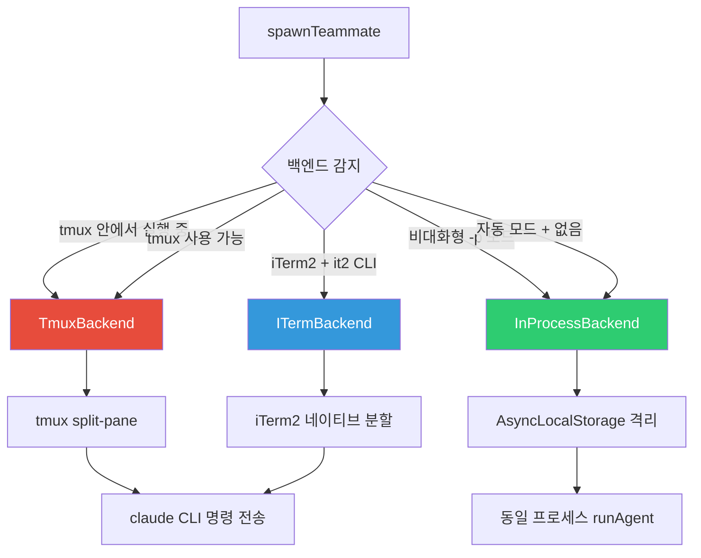
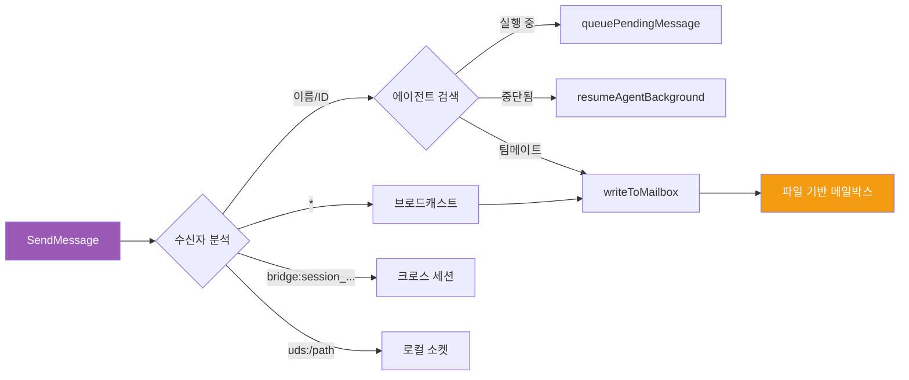
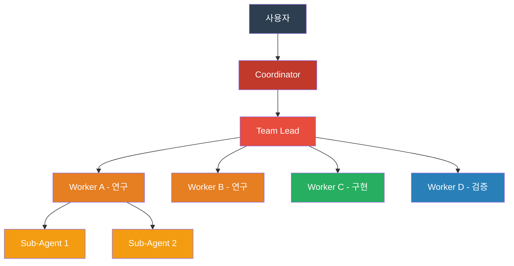
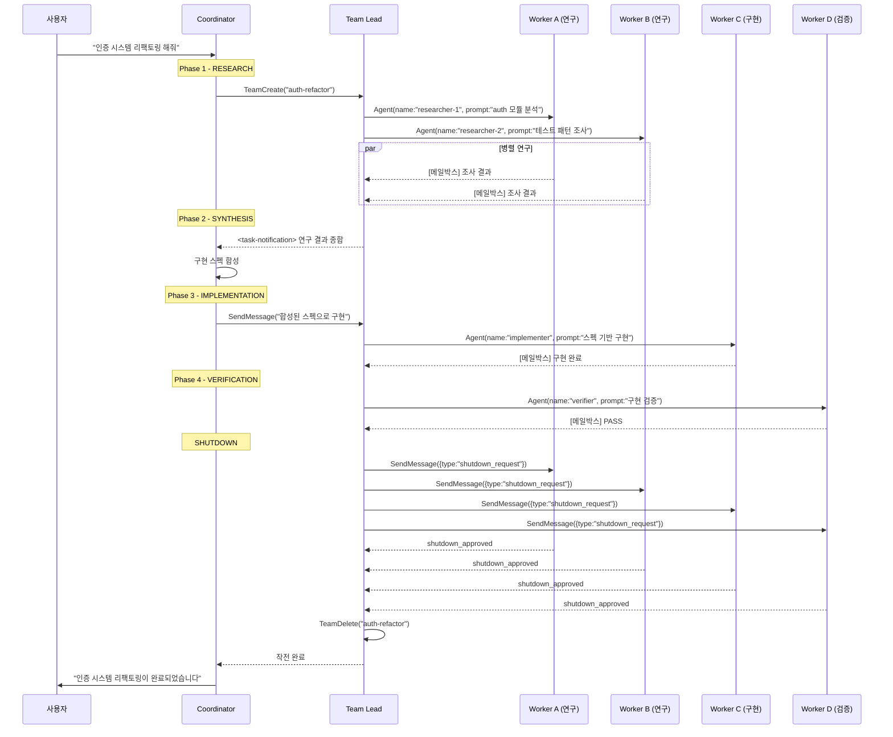
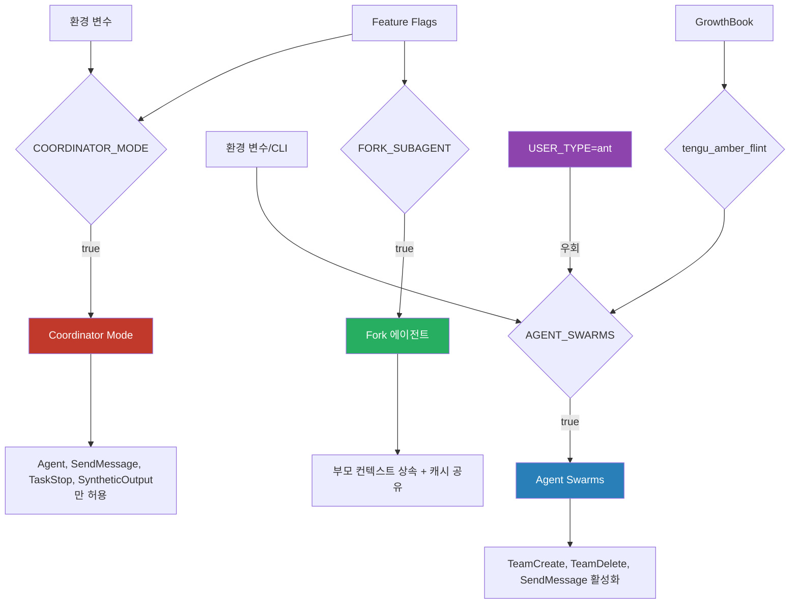

# Report 3: 군단 (Legion)

> **"코드를 짜는 건 하나의 Claude가 아닙니다. 군단입니다."**

---

## 서론: 하나의 Claude는 시작일 뿐이었습니다

Report 2에서 우리는 Anthropic이 28개의 피처 플래그와 텔레메트리 파이프라인으로 Claude Code를 원격 관찰하고 제어하는 메커니즘을 보았다. 그러나 그것은 아직 *하나의* Claude에 대한 이야기였다.

소스코드 9,657줄에 걸쳐 펼쳐진 멀티에이전트 아키텍처는 완전히 다른 이야기를 들려준다. 여기에는 **지휘관**이 있고, **병사**가 있고, **군단**이 있다. 리더가 팀을 소환하고, 병사들이 tmux 세션에서 병렬로 코드를 작성하며, 파일 기반 메일박스로 전령을 주고받는다. 그리고 임무가 끝나면, 지휘관의 셧다운 명령 하나로 군단 전체가 해산된다.

이것은 미래의 이야기가 아니다. 이미 코드 안에 완성되어 있다.

---

## 3.1 소환사 — AgentTool

모든 것은 `AgentTool`에서 시작된다. 1,398줄짜리 이 단일 파일이 Claude Code 멀티에이전트 시스템의 **관문**이다.

### 세 갈래의 길

AgentTool은 입력에 따라 세 가지 완전히 다른 실행 경로로 분기한다:

```
AgentTool.call()
  │
  ├─ [경로 1] team_name + name 있음?
  │   └── YES → spawnTeammate()
  │       팀메이트를 tmux/iTerm2/in-process로 스폰
  │       → "teammate_spawned" 반환
  │
  ├─ [경로 2] run_in_background / coordinator / fork?
  │   └── YES → runAsyncAgentLifecycle()
  │       비동기 실행, 즉시 제어권 반환
  │       → "async_launched" 반환
  │
  └─ [경로 3] 그 외
      └── runAgent() — 동기 실행
          부모가 완료까지 대기
          → "completed" 반환
```

경로 1은 **Agent Swarms** — 팀 리더가 팀메이트를 스폰하는 경로다. 경로 2는 **Coordinator Mode** — 코디네이터가 워커를 비동기로 파견하는 경로다. 경로 3은 가장 단순한 동기 서브에이전트 호출이다.

하나의 도구가 세 가지 전혀 다른 멀티에이전트 패턴을 품고 있다. 이 설계는 의도적이다 — 모든 에이전트 생성은 반드시 이 관문을 통과해야 하므로, 권한 검증, 도구 필터링, 재귀 방지를 한 곳에서 처리할 수 있다.

### 비동기 전환 조건

다음 중 하나라도 참이면 에이전트는 비동기로 실행된다:

| 조건 | 설명 |
|------|------|
| `run_in_background === true` | 명시적 백그라운드 요청 |
| `selectedAgent.background === true` | 에이전트 정의에 background 플래그 |
| `isCoordinator` | 코디네이터 모드 활성 |
| `isForkSubagentEnabled()` | Fork 실험 활성 시 **모든** 스폰이 비동기 |
| 2분 초과 실행 | 자동 백그라운드 전환 (mid-flight backgrounding) |

특히 마지막 조건이 흥미롭다. 동기 에이전트가 2분 이상 걸리면, 시스템이 자동으로 `Promise.race([nextMessage, backgroundSignal])`을 통해 비동기로 전환한다. 부모는 즉시 해방되고, 자식은 백그라운드에서 계속 실행된다.

---

## 3.2 분신술 — Fork Subagent

일반 서브에이전트는 빈 컨텍스트에서 시작한다. 마치 기억을 잃은 채 전장에 투입되는 병사와 같다. 반면 **Fork 서브에이전트**는 부모의 기억을 통째로 물려받는다.

### 부모 컨텍스트 상속

| 속성 | Fork 에이전트 | 일반 에이전트 |
|------|-------------|-------------|
| 대화 기록 | 부모 전체 상속 | 빈 상태에서 시작 |
| 시스템 프롬프트 | 부모의 렌더링된 프롬프트 그대로 | 자체 `getSystemPrompt()` |
| 도구 풀 | 부모와 정확히 동일 | 독립 `assembleToolPool()` |
| thinking | 부모 설정 상속 | `disabled` |
| 모델 | 부모 모델 상속 | 에이전트 정의의 모델 |

### 바이트 동일 API prefix — 캐시 공유의 비밀

Fork의 진짜 천재성은 **프롬프트 캐시 공유**에 있다.

Fork 자식들은 동일한 부모로부터 갈라져 나오므로, API에 전송되는 메시지의 앞부분(prefix)이 바이트 단위로 동일하다. 구체적으로:

```
Fork 메시지 구조:
[
  assistantMessage (모든 tool_use 블록 포함 — 원본 복제),
  userMessage {
    tool_result[] → 각각 "Fork started — processing in background"
    text: "<fork_boilerplate>규칙...</fork_boilerplate>
           [fork_directive]실제 지시문"    ← 여기만 다름
  }
]
```

모든 fork 자식이 동일한 placeholder tool_result를 사용하기 때문에, 마지막 text 블록의 `[fork_directive]` 부분만 다르다. 이것은 Anthropic의 API 캐시가 prefix 매칭 기반이라는 점을 이용한 것이다 — 여러 fork 자식이 동시에 실행되어도 캐시 히트율이 극대화된다.

> **놀라운 포인트**: 10개의 fork 에이전트가 동시에 스폰되면, 시스템 프롬프트 + 부모 대화 기록 부분은 한 번만 캐시되고 10번 재사용된다. 토큰 비용이 1/10로 줄어드는 것은 아니지만, 캐시 가능한 prefix 부분의 비용이 극적으로 감소한다.

### Worktree 격리

Fork 에이전트가 파일을 수정해야 할 때, Git worktree로 완전히 격리된 작업 복사본을 생성한다:

```
createAgentWorktree("agent-<agentId>")
  → <gitRoot>/.claude/worktrees/<slug>/
  → 임시 브랜치 생성
  → .claude/settings 심볼릭 링크
```

이렇게 하면 여러 에이전트가 동시에 같은 저장소의 다른 파일을 수정해도 충돌이 발생하지 않는다. 각자의 worktree에서 독립적으로 커밋하고, 나중에 병합한다.

---

## 3.3 지휘관 — Coordinator Mode

Coordinator Mode는 Claude Code의 가장 순수한 오케스트레이션 패턴이다. 코디네이터는 **직접 아무것도 하지 않는다**. 코드를 읽지 않고, 파일을 수정하지 않으며, 셸 명령을 실행하지 않는다. 오직 4개의 도구만 사용한다:

```typescript
COORDINATOR_MODE_ALLOWED_TOOLS = {
  "Agent",           // 워커 스폰
  "SendMessage",     // 워커와 통신
  "TaskStop",        // 워커 강제 중단
  "SyntheticOutput"  // 구조화된 출력
}
```

Bash, Read, Edit, Write — 실전 도구에 대한 접근 권한이 **완전히 차단**된다. 지휘관은 칼을 들지 않는다. 병사를 지휘할 뿐이다.

### 4단계 작전 파이프라인

코디네이터 시스템 프롬프트(370줄)가 정의하는 워크플로우:

```
┌─────────────────────────────────────────────────┐
│  Phase 1: RESEARCH (정찰)                        │
│  ├── 워커 A: "auth 모듈 구조 조사"                │
│  ├── 워커 B: "테스트 패턴 분석"                    │
│  └── 병렬 실행 → 결과를 <task-notification>으로 수신│
├─────────────────────────────────────────────────┤
│  Phase 2: SYNTHESIS (종합)    ← 코디네이터가 직접  │
│  └── 워커 결과를 이해하고 구체적 구현 스펙으로 합성   │
├─────────────────────────────────────────────────┤
│  Phase 3: IMPLEMENTATION (구현)                   │
│  └── 워커 C: 합성된 스펙 기반 구현                  │
├─────────────────────────────────────────────────┤
│  Phase 4: VERIFICATION (검증)                     │
│  └── 워커 D: 구현 결과 검증                        │
└─────────────────────────────────────────────────┘
```

Phase 2가 핵심이다. 코디네이터는 워커 결과를 단순히 전달하는 것이 아니라 **이해하고 합성**한다. 시스템 프롬프트에는 다음과 같은 금기 사항이 명시되어 있다:

- "Based on your findings..." 같은 **게으른 위임** 금지
- 워커 프롬프트는 **자기완결적**(self-contained)이어야 함
- context overlap이 크면 새 워커를 스폰하지 말고 기존 워커에 SendMessage

### 워커 결과 수신 — XML 전령

워커가 완료되면 코디네이터에게 **user 메시지**로 XML이 주입된다:

```xml
<task-notification>
  <task-id>{agentId}</task-id>
  <status>completed</status>
  <summary>Agent "Investigate auth bug" completed</summary>
  <result>{agent의 최종 텍스트 응답}</result>
  <usage>
    <total_tokens>15234</total_tokens>
    <tool_uses>12</tool_uses>
    <duration_ms>45000</duration_ms>
  </usage>
</task-notification>
```

코디네이터는 이 XML을 마치 사용자 메시지처럼 수신하지만, `<task-notification>` 태그로 워커 보고임을 구별한다. 전장의 전령이 지휘소에 보고서를 전달하는 것과 같다.

---

## 3.4 군단 — Agent Swarms

Coordinator Mode가 "지휘관 + 병사" 패턴이라면, Agent Swarms는 "팀 리더 + 팀메이트" 패턴이다. 가장 큰 차이 — **팀 리더는 직접 도구를 사용하면서 동시에 팀메이트를 관리**한다. 전장에서 직접 싸우면서 부대를 지휘하는 야전 사령관이다.

### TeamCreateTool — 팀 소환

```
TeamCreate 호출 흐름:
  1. 고유 팀 이름 생성 (충돌 시 wordSlug로 재생성)
  2. 리더 에이전트 ID: "team-lead@{teamName}"
  3. TeamFile 생성 → ~/.claude/teams/{team-name}/config.json
  4. 태스크 디렉토리 → ~/.claude/tasks/{team-name}/
  5. 세션 종료 시 자동 정리 등록
```

생성된 TeamFile의 구조:

```typescript
TeamFile = {
  name: string,                    // "alpha-squad"
  createdAt: number,               // Unix 타임스탬프
  leadAgentId: string,             // "team-lead@alpha-squad"
  members: [{
    agentId: string,               // "researcher@alpha-squad"
    name: string,                  // "researcher"
    backendType: BackendType,      // 'tmux' | 'iterm2' | 'in-process'
    tmuxPaneId: string,            // tmux 창 ID
    cwd: string,                   // 작업 디렉토리
    worktreePath?: string,         // Git worktree 경로
    isActive?: boolean,            // false=idle, true=active
    subscriptions: string[]        // 메시지 구독
  }]
}
```

### 3개의 백엔드 — 가장 놀라운 발견

> **놀라운 포인트**: Agent Swarms의 팀메이트는 실제 **tmux 분할 창**에서 독립 프로세스로 실행된다. 터미널 멀티플렉서가 AI 에이전트의 병렬 실행 인프라로 사용되고 있다.



**백엔드 감지 우선순위**:

1. **tmux 안에서 실행 중** → tmux (항상 우선)
2. **iTerm2 + it2 CLI 설치됨** → iTerm2 네이티브 분할 창
3. **iTerm2 + tmux (it2 미설치)** → tmux (it2 설치 권유)
4. **tmux 사용 가능** → tmux 외부 세션 생성
5. **비대화형 세션 (`-p`)** → in-process (항상)
6. **auto 모드 + 백엔드 없음** → in-process 폴백

tmux와 iTerm2 백엔드에서는 팀메이트가 **완전히 독립된 프로세스**로 실행된다. 각 팀메이트는 자기만의 `claude` CLI 인스턴스이며, 자기만의 메모리와 도구를 가진다. 사용자가 터미널에서 직접 각 팀메이트의 작업 상황을 볼 수 있다.

In-Process 백엔드는 동일 Node.js 프로세스 안에서 `AsyncLocalStorage`를 통해 격리된 컨텍스트로 실행된다. 독립 `AbortController`, 독립 메시지 히스토리를 가지지만, API 클라이언트와 MCP 연결은 공유한다.

```
In-Process 팀메이트 컨텍스트 격리:
├── 독립 AbortController (리더 중단과 분리)
├── 독립 메시지 히스토리
├── 동일 API 클라이언트 공유
├── 동일 MCP 연결 공유
└── 파일 기반 메일박스로 통신
```

---

## 3.5 대화 — SendMessageTool

918줄의 `SendMessageTool`은 에이전트 간 통신의 모든 것을 담당한다. 단순한 메시지 전달부터 셧다운 프로토콜, 계획 승인까지.

### 메시지 라우팅



### 파일 기반 메일박스 시스템

팀메이트 간 통신의 핵심은 `~/.claude/teams/{team_name}/inboxes/{agent_name}.json` 파일이다.

```
writeToMailbox(recipientName, message, teamName):
  1. lockfile으로 동시접근 보호 (retries: 10, minTimeout: 5ms)
  2. 기존 메시지 읽기
  3. 새 메시지 append (read: false)
  4. 원자적 쓰기
```

lockfile 기반 동기화가 사용된다. 여러 에이전트가 동시에 같은 메일박스에 쓰려 할 때 race condition을 방지하기 위해, 10회 재시도와 5ms 최소 타임아웃의 lock을 건다. 분산 시스템의 기본 원칙이 파일 시스템 위에 구현되어 있다.

### 구조화 메시지 타입

일반 텍스트 메시지 외에 5종의 구조화 메시지가 있다:

| 타입 | 용도 |
|------|------|
| `shutdown_request` | 종료 요청 (requestId, from, reason) |
| `shutdown_approved` | 종료 승인 (requestId, from, paneId, backendType) |
| `shutdown_rejected` | 종료 거부 (requestId, from, reason) |
| `plan_approval` | 계획 승인/거부 (requestId, approved, feedback) |
| `idle_notification` | 유휴 알림 (agentName, reason, lastToolUse) |

이 메시지들은 단순한 텍스트가 아니라 **프로토콜**이다. 각각 고유한 핸들러가 있고, 수신 측에서 자동으로 해석되어 행동을 트리거한다.

### 셧다운 프로토콜 — 군의 질서

```
Graceful Shutdown 흐름:

  1. 리더 → SendMessage(to: "researcher", message: {type: "shutdown_request"})
     └── writeToMailbox(target) — 종료 요청 전달

  2. 팀메이트 → 메일박스에서 shutdown_request 수신
     └── 자율 판단: 진행 중 작업 완료 후 응답 결정

  3a. [승인 경로]
      SendMessage(to: "team-lead", message: {type: "shutdown_response", approve: true})
      └── in-process → abortController.abort()
          pane-based → gracefulShutdown(0, 'other')

  3b. [거부 경로]
      SendMessage(to: "team-lead", message: {type: "shutdown_response", approve: false,
                   reason: "아직 테스트 실행 중입니다"})
      └── writeToMailbox(team-lead) — 거부 사유 전달
```

> **놀라운 포인트**: 팀메이트는 셧다운 요청을 **거부**할 수 있다. "아직 작업 중입니다"라고 답하면 리더는 강제 종료하지 않고 기다린다. AI 에이전트에게 자율적 판단권이 부여된 것이다.

### Plan Mode 승인 — 작전 계획 검토

팀메이트가 `plan_mode_required=true`로 스폰되면, 코드 수정 전에 반드시 리더의 승인을 받아야 한다:

```
1. 팀메이트 → 구현 계획 수립
2. 팀메이트 → 리더에게 plan_approval_request 전송
3. 리더 → 검토 후 승인 또는 거부 + 피드백
4a. 승인 → 리더의 permissionMode 상속, 실행 진행
4b. 거부 → 피드백과 함께 반려, 계획 수정 요청
```

---

## 3.6 해산 — TeamDeleteTool

모든 군대에는 해산 절차가 있다. `TeamDeleteTool`은 그 절차를 140줄에 담고 있다.

### 해산 프로토콜

```
TeamDelete 호출 흐름:
  1. 활성(active) 멤버가 남아있는가?
     └── YES → 거부. 먼저 모든 멤버에게 shutdown 필요
     └── NO  → 계속

  2. cleanupTeamDirectories(teamName):
     a. 모든 멤버의 worktree 제거 (git worktree remove --force)
     b. ~/.claude/teams/{team-name}/ 디렉토리 제거
     c. ~/.claude/tasks/{team-name}/ 디렉토리 제거

  3. unregisterTeamForSessionCleanup() — 이중 정리 방지

  4. 상태 초기화:
     └── clearTeammateColors()
     └── clearLeaderTeamName()
     └── AppState.teamContext = undefined
     └── AppState.inbox.messages = []
```

핵심 안전장치: **활성 멤버가 남아있으면 팀 삭제를 거부**한다. 먼저 모든 팀메이트에게 `shutdown_request`를 보내고, 모두 `shutdown_approved`로 응답한 후에야 팀을 해산할 수 있다. 전투 중인 병사를 남겨두고 철수하는 일은 없다.

### 비상 정리 — 세션 종료 시

프로세스가 SIGINT/SIGTERM으로 강제 종료될 때를 대비한 안전망이 있다:

```
cleanupSessionTeams():
  ├── 고아 팀 디렉토리 스캔
  ├── 고아 tmux pane 강제 kill
  ├── 고아 iTerm2 pane 정리
  └── worktree 강제 제거 (rm -rf 폴백)
```

tmux에서 실행 중이던 에이전트 프로세스가 고아가 되는 것을 방지한다.

---

## 3.7 재귀의 끝 — Workers Spawning Workers

이론적으로, 워커가 또 다른 워커를 스폰할 수 있다. AgentTool은 서브에이전트 안에서도 사용 가능하기 때문이다(Anthropic 내부 빌드 기준). 이것은 **재귀적 에이전트 트리**를 형성한다.



그러나 무한 재귀를 방지하는 장치들이 있다:

| 메커니즘 | 대상 | 구현 |
|---------|------|------|
| `ALL_AGENT_DISALLOWED_TOOLS` | Agent 도구 차단 | 외부 빌드에서 서브에이전트의 Agent 도구 제거 |
| `isInForkChild()` | Fork 재귀 방지 | 메시지에 `<fork_boilerplate>` 태그 검색 |
| 팀메이트 제한 | 팀메이트 중첩 방지 | `isTeammate() && name` → 에러 |
| `maxTurns` | 턴 수 제한 | Fork: 200턴, 일반: 에이전트 정의 값 |

외부 빌드(일반 사용자)에서는 서브에이전트가 다시 AgentTool을 호출할 수 없다. 재귀의 깊이는 1로 제한된다. 그러나 Anthropic 내부 빌드(`USER_TYPE === 'ant'`)에서는 이 제한이 풀린다 — 내부에서는 이미 재귀적 에이전트 트리를 실험하고 있다는 뜻이다.

---

## 전체 작전 시퀀스 — 군단의 움직임

모든 것을 종합하면, 하나의 복잡한 작업이 처리되는 전체 시퀀스는 다음과 같다:



사용자는 하나의 명령을 입력했을 뿐이다. 그 뒤에서 6개의 에이전트가 생성되고, 4단계 파이프라인이 실행되며, 수십 개의 메시지가 파일 기반 메일박스를 통해 교환된다.

---

## 이중 오케스트레이션 — 두 가지 군대

Claude Code는 사실 **두 가지** 독립적인 멀티에이전트 패턴을 가지고 있다. 이 둘은 공존하되, 동시에 활성화되지는 않는다:

```
┌─────────────────────────────────────────────────────┐
│  패턴 A: COORDINATOR MODE                            │
│  ┌────────────┐          ┌──────────┐               │
│  │ Coordinator │──Agent──►│ Worker   │               │
│  │ (4개 도구만) │◄─XML────│ Worker   │               │
│  └────────────┘          └──────────┘               │
│  순수 오케스트레이터. 코디네이터는 직접 행동하지 않음     │
├─────────────────────────────────────────────────────┤
│  패턴 B: AGENT SWARMS                                │
│  ┌────────────┐ TeamCreate ┌────────────┐           │
│  │ Team Lead  ├───────────►│ TeamFile   │           │
│  │ (모든 도구  │ Agent()    │ config.json│           │
│  │  사용 가능) │◄─Mailbox──┤            │           │
│  └────────────┘            │ Teammates  │           │
│                            │ (tmux/proc)│           │
│  야전 사령관. 직접 싸우면서 부대를 지휘               │
└─────────────────────────────────────────────────────┘
```

활성화 게이트도 다르다:

- **Coordinator Mode**: `COORDINATOR_MODE` 피처 플래그 + `CLAUDE_CODE_COORDINATOR_MODE` 환경 변수
- **Agent Swarms**: `CLAUDE_CODE_EXPERIMENTAL_AGENT_TEAMS` 환경 변수 또는 `--agent-teams` CLI 플래그 + `tengu_amber_flint` GrowthBook 게이트

> **놀라운 포인트**: Agent Swarms의 GrowthBook 게이트 이름은 `tengu_amber_flint`다. "tengu"(텐구, 일본 신화의 천구)가 멀티에이전트 시스템의 내부 코드명으로 사용되고 있다. 또한 Anthropic 내부 사용자(`USER_TYPE === 'ant'`)는 이 게이트를 우회하여 항상 Agent Swarms를 사용할 수 있다 — 내부에서는 이미 일상적으로 군단을 운용하고 있다는 의미다.

---

## 에이전트 활성화 게이트 전체 지도



---

## 숫자로 보는 군단

| 항목 | 수치 |
|------|------|
| 멀티에이전트 관련 총 코드 | ~9,657줄 |
| AgentTool 단일 파일 | 1,398줄 |
| SendMessageTool | 918줄 |
| in-process 러너 | 1,553줄 |
| 메일박스 시스템 | 1,184줄 |
| 워커 허용 도구 수 | 15종 |
| 코디네이터 허용 도구 수 | 4종 |
| 팀메이트 백엔드 | 3종 (tmux, iTerm2, in-process) |
| 구조화 메시지 타입 | 5종 |
| 빌트인 에이전트 타입 | 7종 |
| Fork 에이전트 maxTurns | 200 |
| 셧다운 lockfile 재시도 | 10회 |

---

## 결론: 잠들어 있는 군단

9,657줄의 코드가 말하는 것은 분명하다. Claude Code는 단일 에이전트 도구가 아니다. 이미 완성된 멀티에이전트 오케스트레이션 플랫폼이다.

지휘관(Coordinator)은 4개의 도구만으로 전체 작전을 통제한다. 분신(Fork)은 부모의 기억을 물려받아 바이트 단위 캐시 공유로 효율을 극대화한다. 군단(Swarms)은 tmux 분할 창에서 실제 독립 프로세스로 뛰며, 파일 기반 메일박스로 전령을 주고받는다. 그리고 이 모든 것이 피처 플래그 하나로 깨어난다.

`tengu_amber_flint` — 이 게이트가 열리는 순간, 하나의 Claude는 군단이 된다.

그러나 군단은 아직 시작일 뿐이다. Report 4 "각성"에서는 더 깊은 심해로 내려간다. 사용자가 부르지 않아도 스스로 깨어나는 Claude — KAIROS, PROACTIVE, DAEMON. 스케줄에 따라 자율적으로 행동하고, GitHub 웹훅에 반응하며, 백그라운드에서 잠들지 않는 에이전트 플랫폼의 전모가 드러난다.

군단은 깨어났다. 그리고 내일, 군단은 **스스로** 깨어날 것이다.

---

> *다음 리포트: [Report 4 — "각성" (Awakening)](/docs/reports/report-4_awakening.md)*
> *이전 리포트: [Report 2 — "감시탑" (Watchtower)](/docs/reports/report-2_watchtower.md)*
