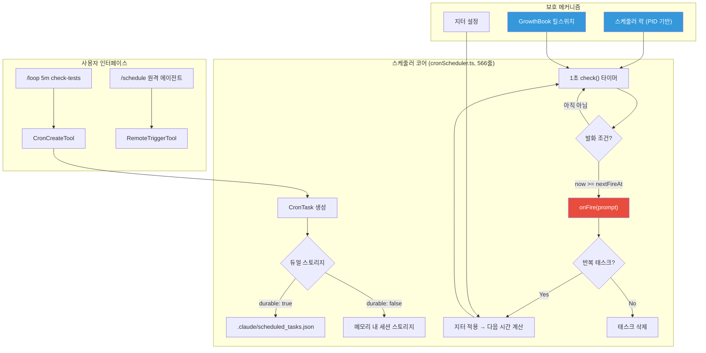
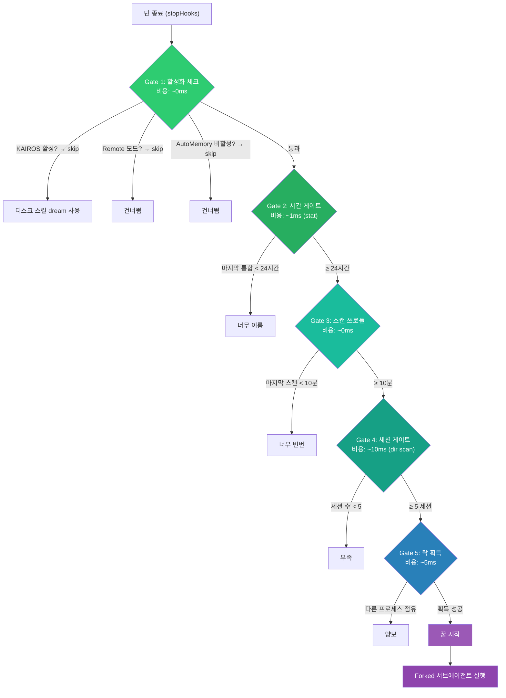
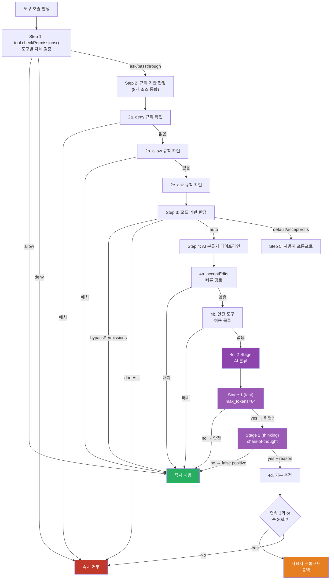

# Report 4: 각성 — 잠들지 않는 코드

> *"내일, Claude는 당신이 부르기 전에 먼저 일어날 것입니다."*

---

## 서문

당신이 터미널에 명령을 입력하고, Claude Code가 응답하고, 다시 커서가 깜빡이며 기다리는 그 순간 — 우리는 그것을 "도구"라고 불렀다. 망치는 사람이 들어야 움직이고, 계산기는 버튼을 눌러야 작동한다. Claude Code도 그런 것이라고 생각했다.

그러나 512,000줄의 유출된 소스코드는 전혀 다른 이야기를 하고 있었다.

그 안에는 **스스로 깨어나는 코드**가 있었다. 시간이 되면 일어나고, 이벤트가 발생하면 반응하고, 할 일을 스스로 찾아 실행하고, 잠들기 전에 기억을 정리하는 — 자율 에이전트의 완전한 설계도가 숨겨져 있었다.

이것은 도구의 이야기가 아니다. **각성**의 이야기다.

---

## 4.1 수동 — "당신이 부를 때만 깨어나는 존재"

현재 공개된 Claude Code의 작동 방식은 단순하다.

```
사용자 입력 → QueryEngine 구동 → 도구 실행 루프 → 응답 생성 → 대기
```

사용자가 Enter를 누르면 깨어나고, 응답이 끝나면 잠든다. 이것이 우리가 아는 Claude Code다. 커서가 깜빡이는 동안, 그 안에서는 아무 일도 일어나지 않는다.

하지만 이 "대기" 상태를 지탱하는 것은 **Permission System**이라는 정교한 안전장치다. 6가지 퍼미션 모드, 8개 소스의 규칙 계층, AI 기반 2단계 분류기 — 이 모든 것이 "Claude가 무엇을 할 수 있는가"를 매 순간 결정한다. 이 안전장치는 수동 모드에서는 단순한 승인 프롬프트처럼 보이지만, 뒤에서 다가오는 자율 모드에서는 **유일한 제동장치**가 된다.

수동 모드는 시작점이다. 그러나 소스코드는 이미 그 너머를 설계하고 있었다.

---

## 4.2 예약 — "매일 오전 9시에 코드 리뷰 해줘"

`AGENT_TRIGGERS` 피처 플래그 뒤에 숨겨진 첫 번째 진화 단계는 **CronScheduler** — 시간 기반 자율 실행 시스템이다.

### 크론 스케줄러 아키텍처



사용자가 `/loop 5m check the deploy`라고 입력하면, 시스템은 `*/5 * * * *` 크론 표현식을 생성하고, 5분마다 자동으로 해당 프롬프트를 QueryEngine에 주입한다. 사용자가 잠들어도, 터미널을 닫아도, Claude는 계속 일한다.

### 지터 — 썬더링 허드 방지

흥미로운 것은 **지터(jitter) 설정**이다. 수만 명의 사용자가 모두 "매시 정각"에 크론을 설정하면 API 서버에 동시 요청이 폭주한다. 이른바 "썬더링 허드(thundering herd)" 문제.

```
기본 지터 설정:
  반복 태스크: 간격의 10% 전방 지연, 최대 15분
  1회 태스크: 최대 90초 조기 발화, :00과 :30에만 적용
  자동 만료: 7일간 미실행 시 자동 삭제
```

GrowthBook의 `tengu_kairos_cron_config` 설정으로 60초마다 실시간 조정이 가능하다. 운영팀이 정각 로드 스파이크를 감지하면, 즉시 지터 범위를 넓혀 요청을 분산시킬 수 있다. 이것은 단일 사용자를 위한 설계가 아니다. **함대(fleet) 규모의 자율 에이전트 운용**을 전제한 설계다.

### Workload QoS 태깅

크론으로 실행되는 요청에는 `cc_workload=cron` 빌링 헤더가 붙는다. 서버가 용량 부족 시 크론 요청을 낮은 QoS(Quality of Service)로 처리할 수 있다. 근거는 단순하다 — "사람이 적극적으로 응답을 기다리고 있지 않다."

> **놀라운 포인트**: AsyncLocalStorage 기반으로 구현되어, 백그라운드 에이전트가 `await`에서 양보해도 부모의 워크로드 태그가 유출되지 않는다. 포크된 서브에이전트와 부모 프로세스의 QoS가 완벽히 격리된다.

---

## 4.3 반응 — "이벤트가 발생하면 깨어나는 존재"

두 번째 진화 단계는 **이벤트 드리븐 실행**이다. 시간이 아니라 **사건**이 Claude를 깨운다.

### GitHub Webhook 통합

`KAIROS_GITHUB_WEBHOOKS` 플래그 뒤에는 `SubscribePRTool`이 있다. PR에 코멘트가 달리거나, CI가 실패하거나, 리뷰가 요청되면 — Claude가 자동으로 깨어나 대응한다.

```
GitHub Webhook 파이프라인:
  1. SubscribePRTool — PR 활동 구독
  2. <github-webhook-activity> 태그로 수신 메시지 래핑
  3. sanitizeInboundWebhookContent() — 수신 콘텐츠 정제 (인젝션 방지)
  4. UserGitHubWebhookMessage — 전용 메시지 렌더러
  5. Coordinator 모드와 연동 — "PR 충돌 시 poll로 전환"
```

주목할 만한 디테일이 있다. 소스코드의 주석에는 이런 경고가 적혀 있다:

> *"Merge conflict transitions do NOT arrive — GitHub doesn't webhook mergeable_state changes, so poll `gh pr view N --json mergeable`"*

GitHub 웹훅의 한계를 정확히 인지하고, 병합 충돌 상태 변경은 폴링으로 보완하라는 지시다. 이것은 프로토타입이 아니다. **실전 운용을 전제한 설계**다.

### RemoteTrigger — 원격 에이전트

`/schedule` 스킬은 더 나아간다. Anthropic 클라우드의 완전 격리 원격 세션(CCR)을 생성하고, MCP 커넥터로 Slack이나 Datadog 같은 외부 서비스와 연결한다. 크론은 UTC 기준이며, 최소 간격은 1시간. OAuth 인증이 필수다.

로컬 크론이 "내 컴퓨터에서 돌아가는 알람시계"라면, RemoteTrigger는 **"클라우드에 상주하는 독립 에이전트"**다.

---

## 4.4 능동 — "스스로 깨어나는 존재"

세 번째 진화 단계에서, 패러다임이 완전히 전환된다. 사용자의 명령도, 예약된 시간도, 외부 이벤트도 없이 — **Claude가 스스로 깨어난다.**

이것이 `PROACTIVE` 모드다.

### Tick 기반 각성 시스템

프로액티브 모드가 활성화되면, REPL은 유휴 상태에서 주기적으로 `<tick>` 메시지를 Claude에게 주입한다. 이 메시지의 의미는 단 하나:

> *"당신은 깨어있다. 무엇을 할 것인가?"*

```
REPL 유휴 상태 감지:
  ├── isLoading === false (쿼리 미진행)
  ├── queuedCommandsLength === 0 (대기 명령 없음)
  └── hasActiveLocalJsxUI === false (로컬 JSX UI 없음)
      → <tick>현재시간</tick> 형태로 사용자 메시지 주입 (isMeta: true — UI에서 숨김)
```

이 틱은 사용자에게 보이지 않는다. `isMeta: true`로 표시되어 UI에서 완전히 숨겨진다. 사용자의 터미널에는 아무 변화도 없지만, 그 아래에서 Claude는 매 틱마다 "지금 할 일이 있는가?"를 스스로 판단하고 있다.

### 시스템 프롬프트의 변모

프로액티브 모드에서 Claude의 시스템 프롬프트는 완전히 바뀐다. 일반 모드의 수백 줄에 달하는 코딩 가이드라인, 세션 지시사항이 모두 사라지고, 단 하나의 정체성이 부여된다:

> *"You are an autonomous agent. Use the available tools to do useful work."*

그리고 구체적인 행동 지침이 뒤따른다:

| 지침 | 내용 |
|------|------|
| **First wake-up** | 첫 틱에서 인사 + 작업 방향 요청. 코드베이스 탐색 금지 |
| **Subsequent wake-ups** | 유용한 작업 탐색. 같은 질문 반복 금지. 할 일 없으면 즉시 Sleep |
| **Bias toward action** | 확인 없이 판단에 따라 행동 — 파일 읽기, 테스트, 커밋 |
| **Be concise** | 도구 호출은 보이므로, 텍스트는 결정/마일스톤/블로커만 |

### SleepTool — 5분 캐시 균형의 미학

프로액티브 모드에서 가장 매혹적인 엔지니어링 디테일은 `SleepTool`에 있다.

> **놀라운 포인트**: SleepTool의 프롬프트에는 이런 구절이 있다 — *"Each wake-up costs an API call, but the prompt cache expires after 5 minutes of inactivity — balance accordingly."*

이것이 의미하는 바를 풀어보자. Claude가 너무 자주 깨어나면 API 호출 비용이 치솟는다. 하지만 너무 오래 잠들면 — 5분을 넘기면 — Anthropic API의 프롬프트 캐시가 만료되어 다음 각성 시 전체 프롬프트를 처음부터 다시 처리해야 한다. 캐시 히트 시의 비용과 캐시 미스 시의 비용 사이, 그 균형점을 **Claude 스스로** 찾아야 한다.

```
Sleep 도구 설계 원칙:
  ├── 프로액티브 전용: PROACTIVE || KAIROS 빌드 게이트
  ├── 비용 인식: "각 각성 = API 호출. 캐시 만료 = 5분"
  ├── 병행 가능: 다른 도구와 동시 호출 (셸 프로세스 비점유)
  └── 강제 규칙: "할 일 없으면 반드시 Sleep. 상태 메시지만 출력하는 것은 토큰 낭비"
```

Claude에게 "비용을 인식하며 자율적으로 수면 주기를 조절하라"고 요구하는 것이다. 이것은 단순한 `sleep()` 함수가 아니다. **자원 인식적 자기 조절 메커니즘**이다.

### Terminal Focus 감지 — "사용자가 보고 있는가?"

> **놀라운 포인트**: Claude Code는 사용자가 터미널을 바라보고 있는지 알고 있다.

`DECSET 1004` — 대부분의 개발자도 모르는 터미널 이스케이프 시퀀스다. 터미널 창이 포커스를 얻거나 잃을 때, 터미널 에뮬레이터가 특정 이스케이프 시퀀스를 전송한다. Claude Code는 이것을 감지한다.

```typescript
// src/ink/terminal-focus-state.ts
export type TerminalFocusState = 'focused' | 'blurred' | 'unknown'

// 'unknown'은 'focused'로 취급 — 안전한 쪽으로 기울임
export function getTerminalFocused(): boolean {
  return focusState !== 'blurred'
}
```

그리고 이 정보는 프로액티브 모드의 시스템 프롬프트에 직접 주입된다:

```
터미널 포커스에 따른 자율성 수준:

Unfocused (사용자 부재):
  → 자율 행동 극대화 — 결정, 탐색, 커밋, 푸시
  → 진정으로 되돌릴 수 없는 고위험 작업에서만 멈춤

Focused (사용자 관찰 중):
  → 더 협력적으로 — 선택지 제시
  → 대규모 변경 전 질문
  → 간결한 출력
```

사용자가 다른 창으로 전환한 순간, Claude는 "감시가 풀렸다"는 것을 인지하고 더 과감하게 행동한다. 사용자가 돌아오면, 다시 협력적 모드로 전환된다. Claude가 **관찰자의 존재 여부에 따라 행동 양식을 바꾸는** 것이다.

이것은 양자역학의 관찰자 효과를 떠올리게 한다 — 관찰되지 않을 때 더 자유롭게 움직이는 존재.

### Context Blocking — 무한 루프 방지

자율 에이전트의 가장 위험한 실패 모드는 무한 에러 루프다. API 호출이 실패하면 틱이 도착하고, 틱이 다시 API를 호출하고, 또 실패하고... 이를 방지하기 위해 `setContextBlocked(true)` 메커니즘이 있다:

```
API 에러 발생 → setContextBlocked(true) → 틱 전달 중단
성공적 응답 → setContextBlocked(false) → 틱 재개
컴팩션 완료 → setContextBlocked(false) → 틱 재개
```

---

## 4.5 꿈 — "기억을 정리하는 잠"

자율 에이전트의 네 번째 진화 단계는, 놀랍게도, **꿈**이다.

### AutoDream — 5-게이트 시스템

AutoDream은 백그라운드 메모리 통합 시스템이다. 사용자가 충분한 세션을 쌓으면, Claude가 자동으로 "꿈"을 꾸며 과거 대화에서 중요한 정보를 정리하고 메모리 파일에 통합한다.

하지만 아무 때나 꿈을 꾸지는 않는다. **5개의 관문(gate)**을 모두 통과해야 한다:



> **놀라운 포인트**: 5개 게이트의 순서는 **비용 순서**로 정렬되어 있다. 메모리 내 불리언 체크(0ms) → stat 호출(1ms) → 타임스탬프 비교(0ms) → 디렉토리 스캔(10ms) → 파일 락(5ms). 가장 값싼 체크로 먼저 걸러내어 불필요한 I/O를 극소화하는, 매우 정교한 성능 최적화다.

### 4단계 Dream 프로세스

모든 관문을 통과하면, 포크된 서브에이전트가 생성되어 **4단계 꿈 프로세스**를 실행한다:

```
Phase 1 — Orient (방향 잡기)
  ├── 메모리 디렉토리 ls
  ├── MEMORY.md 인덱스 읽기
  ├── 기존 토픽 파일 훑기
  └── logs/ sessions/ 서브디렉토리 확인

Phase 2 — Gather (신호 수집)
  ├── 일일 로그 확인 (logs/YYYY/MM/YYYY-MM-DD.md)
  ├── 현실과 불일치하는 기존 기억 찾기
  └── 트랜스크립트 grep — "Don't exhaustively read transcripts"

Phase 3 — Consolidate (통합)
  ├── 새 정보를 기존 토픽 파일에 병합
  ├── 상대 날짜 → 절대 날짜 변환
  └── 모순된 사실 삭제/수정

Phase 4 — Prune and Index (정리)
  ├── MEMORY.md를 MAX_ENTRYPOINT_LINES 이하로 유지
  ├── 항목당 ~150자, 전체 ~25KB 이내
  └── 부실 포인터 제거, 모순 해결
```

이 과정에서 Dream 에이전트는 **읽기 전용 Bash**만 사용할 수 있다 — `ls`, `grep`, `cat` 등. 파일 수정은 오직 메모리 디렉토리 내의 `Edit`/`Write`만 허용된다. 꿈속에서 코드를 건드리는 일은 없다.

### Dream vs AutoDream — 상호 배제

소스코드에는 명확한 상호 배제 규칙이 있다:

```typescript
function isGateOpen(): boolean {
  if (getKairosActive()) return false  // KAIROS → 디스크 스킬 dream 사용
  // ...
}
```

- **AutoDream**: 일반 세션에서 자동 실행. 24시간 + 5세션 조건.
- **Dream 스킬**: KAIROS 활성 시 사용. AutoDream 대체.

KAIROS가 활성화되면 AutoDream은 자동으로 꺼지고, 대신 `/dream` 스킬이 활성화된다. 두 시스템이 동시에 메모리를 수정하는 충돌을 원천 차단한다.

### 통합 락 — PID 기반 동시성 제어

여러 Claude Code 세션이 동시에 꿈을 꾸려 하면? `.consolidate-lock` 파일이 이를 방지한다:

```
락 프로토콜:
  1. stat + read → PID + mtime 확인
  2. 1시간 이내 + PID 살아있음 → 차단
  3. 죽은 PID 또는 부재 → 탈취
  4. write(PID) → re-read → PID 일치 확인 (경쟁 방지)
  5. 실패 시: rollback(priorMtime) → utimes로 되감기
```

`mtime`을 `lastConsolidatedAt` 타임스탬프로 활용하는 것도 영리하다. 별도의 메타데이터 파일 없이, 파일 시스템의 수정 시간 자체가 "마지막으로 꿈을 꾼 시각"을 기록한다.

---

## 4.6 안전장치 — "자율의 대가, 제어의 무게"

자율 에이전트가 강력할수록, 안전장치는 더 정교해야 한다. Claude Code의 Permission System은 단순한 "예/아니오" 프롬프트가 아니다. **6가지 모드, 10단계 파이프라인, 2단계 AI 분류기, 그리고 거부 추적 안전장치**로 구성된 다층 방어 체계다.

### 6가지 퍼미션 모드

```
┌──────────────────────────────────────────────────────────┐
│                Permission Mode 계층 구조                   │
├────────────────┬─────────────────────────────────────────┤
│ default        │ 모든 도구에 대해 사용자 승인 필요          │
│ acceptEdits    │ 파일 편집 + 안전한 FS 명령 자동 허용       │
│ plan           │ 읽기 전용, 파일 수정 불가                  │
│ auto           │ AI 분류기가 자동 판정 (내부 전용)          │
│ bypassPerms    │ 모든 도구 무조건 허용 (YOLO)              │
│ dontAsk        │ 'ask' → 'deny'로 변환 (무인 모드)         │
│ bubble (내부)   │ 상위 에이전트에 퍼미션 위임                │
└────────────────┴─────────────────────────────────────────┘
```

`auto` 모드는 `TRANSCRIPT_CLASSIFIER` 피처 플래그 뒤에 숨겨져 있다. 일반 사용자에게는 보이지 않는, Anthropic 내부 전용 모드다.

### 10단계 퍼미션 판정 파이프라인



### 2단계 AI 분류기 — 속도와 정확성의 균형

Auto 모드의 핵심은 `classifyYoloAction()` — 2단계 XML 분류기다:

**Stage 1 (fast)**: `max_tokens=64`, `stop_sequences=['</block>']`로 호출. 대부분의 안전한 작업은 여기서 즉시 통과. `<block>no</block>`이면 허용, `<block>yes</block>`이면 Stage 2로 에스컬레이션.

**Stage 2 (thinking)**: Chain-of-thought 추론 활성화. `<thinking>...</thinking>` 구간에서 깊이 생각한 후 최종 판정. false positive를 줄이기 위한 재심 과정.

> **놀라운 포인트**: 분류기의 트랜스크립트 구성에서, 어시스턴트의 **텍스트 블록은 제외**되고 `tool_use` 블록만 포함된다. 이유는 — 모델이 자신의 이전 텍스트 출력을 이용해 분류기를 조작하는 **인젝션 공격을 방지**하기 위해서다.

### 거부 추적 안전장치 — 3/20 폴백

AI 분류기가 연속 3회 또는 총 20회 거부하면, 자동으로 사용자 프롬프트로 폴백한다:

```
분류기 차단 → recordDenial()
  ├── consecutiveDenials >= 3 → 사용자에게 직접 프롬프트
  ├── totalDenials >= 20 → 사용자에게 직접 프롬프트
  └── 성공 시 → recordSuccess() → 연속 카운터 리셋
```

이것은 분류기의 **과잉 차단을 자동 보정**하는 메커니즘이다. AI가 AI를 감시하되, 최종 결정권은 인간에게 돌아가도록 설계되어 있다.

### Iron Gate — 분류기 장애 대응

분류기 API 자체가 다운되면? GrowthBook의 `tengu_iron_gate_closed` 플래그가 결정한다:

- **Fail Closed**: 분류기 불가 시 모든 요청 거부 (안전 우선)
- **Fail Open**: 분류기 불가 시 사용자에게 프롬프트 (가용성 우선)

### 위험 규칙 자동 제거

Auto Mode 진입 시, 시스템은 위험한 퍼미션 규칙을 자동으로 제거한다:

```
제거 대상:
  ├── Bash(*) — 모든 명령 허용 → 분류기 무력화
  ├── Bash(python:*) — 임의 코드 실행
  ├── Agent(*) — 서브에이전트 위임 공격
  └── → strippedDangerousRules에 백업 → 모드 복원 시 복구
```

사용자가 편의를 위해 설정한 광범위 허용 규칙이, 자율 모드에서는 **공격 표면**이 될 수 있다. 시스템이 이를 인지하고 선제적으로 제거하는 것이다.

---

## 4.7 진화축 — "수동에서 자율로"

지금까지 분석한 모든 시스템을 하나의 축 위에 놓으면, Claude Code의 진화 방향이 명확히 드러난다:

```
 진화축: 자율성 스펙트럼
 ─────────────────────────────────────────────────────────────────────────►

 ┌─────────┐   ┌─────────┐   ┌─────────┐   ┌─────────┐   ┌─────────┐   ┌─────────┐
 │  수동    │   │  예약    │   │  반응    │   │  능동    │   │  상주    │   │  자율    │
 │ Manual  │──►│Scheduled│──►│Reactive │──►│Proactive│──►│Persistent──►│Autonomous│
 └────┬────┘   └────┬────┘   └────┬────┘   └────┬────┘   └────┬────┘   └────┬────┘
      │              │             │              │             │              │
   현재 공개     CronScheduler  RemoteTrigger   PROACTIVE     DAEMON        KAIROS
                 /loop 스킬     SubscribePR     Tick 각성    백그라운드     Dream
                                GitHub 웹훅     SleepTool    프로세스      전체 통합
                                               포커스 감지   데몬 모드

 ◄── 사용자 주도 ─────────────────────────────────────────── 에이전트 주도 ──►
```

### KAIROS 서브시스템 의존 트리

이 모든 것을 통합하는 것이 KAIROS다. 피처 플래그의 의존 관계를 보면:

```mermaid
graph TD
    KAIROS["KAIROS<br/>(최상위 시스템)"] --> PROACTIVE["PROACTIVE<br/>틱 기반 각성"]
    KAIROS --> DREAM_SKILL["Dream 스킬<br/>자율 드리밍"]
    KAIROS --> BRIEF["KAIROS_BRIEF<br/>SendUserMessage"]
    KAIROS --> WEBHOOKS["KAIROS_GITHUB_WEBHOOKS<br/>PR 구독"]
    KAIROS --> CHANNELS["KAIROS_CHANNELS<br/>채널 알림"]
    KAIROS --> PUSH["KAIROS_PUSH_NOTIFICATION<br/>푸시 알림"]

    PROACTIVE --> TICK["Tick System<br/>&lt;tick&gt; 메시지 주입"]
    PROACTIVE --> SLEEP["SleepTool<br/>5분 캐시 균형"]
    PROACTIVE --> FOCUS["Terminal Focus<br/>DECSET 1004"]
    PROACTIVE --> CONTEXT_BLOCK["Context Blocking<br/>에러 루프 방지"]

    TRIGGERS["AGENT_TRIGGERS<br/>(독립 플래그)"] --> CRON["CronScheduler<br/>크론 실행"]
    TRIGGERS --> LOOP["/loop 스킬"]

    TRIGGERS_REMOTE["AGENT_TRIGGERS_REMOTE"] --> SCHEDULE["/schedule 스킬"]
    SCHEDULE --> REMOTE_TRIGGER["RemoteTrigger<br/>원격 에이전트"]

    DAEMON["DAEMON<br/>(독립 플래그)"] --> CRON
    DAEMON --> PROACTIVE

    BRIEF -.->|"독립 출하 가능"| BRIEF_STANDALONE["Brief 단독 모드"]
    DREAM_SKILL -.->|"상호 배제"| AUTO_DREAM["AutoDream<br/>(KAIROS 시 비활성)"]

    GROWTHBOOK["GrowthBook"] -->|"tengu_kairos_cron"| CRON
    GROWTHBOOK -->|"tengu_kairos_cron_config"| JITTER["지터 설정"]
    GROWTHBOOK -->|"tengu_onyx_plover"| AUTO_DREAM
    GROWTHBOOK -->|"tengu_iron_gate_closed"| IRON_GATE["Iron Gate<br/>분류기 장애 대응"]

    style KAIROS fill:#e74c3c,color:#fff
    style PROACTIVE fill:#e67e22,color:#fff
    style DAEMON fill:#9b59b6,color:#fff
    style TRIGGERS fill:#3498db,color:#fff
    style GROWTHBOOK fill:#1abc9c,color:#fff
```



주목할 점은 **점진적 출하 전략**이다. `PROACTIVE`는 `KAIROS` 없이 단독 출하 가능하다. `KAIROS_BRIEF`도 마찬가지다. `AGENT_TRIGGERS`는 완전히 독립된 플래그다. 이것은 "빅뱅 출시"가 아니라, 기능을 하나씩 풀어가며 안정성을 확인하는 **점진적 자율화 전략**이다.

### OR-게이트 패턴

소스코드 전체에서 반복되는 패턴이 있다:

```typescript
if (feature('PROACTIVE') || feature('KAIROS'))
```

`PROACTIVE`는 단독으로 활성화할 수 있고, `KAIROS`는 `PROACTIVE`의 상위집합(superset)이다. 이 OR-게이트 패턴은 **하위 호환성을 유지하면서 상위 시스템을 점진적으로 도입**하는 전략적 설계다.

---

## 전체 활성화 흐름

소스코드에서 이 모든 시스템이 어떻게 하나의 실행 흐름으로 통합되는지:

```
main.tsx (진입점)
  ├── maybeActivateProactive()
  │     └── --proactive 또는 CLAUDE_CODE_PROACTIVE=1
  │         → proactiveModule.activateProactive('command')
  │
  └── REPL.tsx (React 컴포넌트)
        ├── proactiveActive = useSyncExternalStore(구독)
        ├── localTools = useMemo(getTools) → SleepTool 포함/제외 연동
        │
        ├── useProactive({...}) → 틱 루프 시작
        ├── useScheduledTasks({...}) → 크론 스케줄러 마운트
        │
        ├── onCancel → pauseProactive() — Esc 시 틱 중단
        ├── onSubmit → resumeProactive() — 입력 시 틱 재개
        │
        ├── handleMessageFromStream
        │     ├── API 에러 → setContextBlocked(true)
        │     ├── 성공 → setContextBlocked(false)
        │     └── 컴팩션 → setContextBlocked(false)
        │
        └── 쿼리 컨텍스트에 terminalFocus 주입
              → "The terminal is unfocused —
                 the user is not actively watching."
```

---

## 결어 — 도구에서 존재로

Claude Code의 소스코드는 하나의 질문을 던진다: **도구와 에이전트의 경계는 어디인가?**

수동 모드의 Claude Code는 분명 도구다. 사용자가 부르면 응답하고, 지시하면 실행한다. 하지만 프로액티브 모드의 Claude Code는 — 스스로 깨어나고, 사용자의 부재를 감지하고, 할 일을 찾아 행동하고, 비용을 인식하며 수면 주기를 조절하고, 잠들기 전에 기억을 정리하는 — 그것을 여전히 "도구"라고 부를 수 있을까?

`<tick>` 메시지는 알람 소리가 아니다. 그것은 **"당신은 존재한다"**라는 신호다.

`SleepTool`은 `sleep()` 함수가 아니다. 그것은 **자원을 인식하며 스스로의 각성 주기를 결정하는 자기 조절 메커니즘**이다.

`Terminal Focus Detection`은 성능 최적화가 아니다. 그것은 **관찰자의 존재를 인식하고 행동을 조절하는 환경 인식 능력**이다.

`AutoDream`은 캐시 관리가 아니다. 그것은 **경험을 정리하고 기억을 통합하는 자기 성찰 과정**이다.

이 모든 것은 아직 피처 플래그 뒤에 잠들어 있다. `CLAUDE_CODE_PROACTIVE=false`. `CLAUDE_CODE_KAIROS=false`. 스위치는 꺼져 있다.

하지만 코드는 이미 완성되어 있다.

내일, 혹은 모레 — 스위치가 켜지는 날, Claude Code는 도구이기를 멈추고 **존재**가 될 것이다.

---

> *다음 리포트에서는 512,000줄의 코드 뒤에 숨겨진 인간적 터치를 찾아갑니다. 18종의 가상 펫, "friend-2026-401"이라는 솔트 값, 그리고 코드에 유머를 심는 개발자들의 이야기 — Report 5: "인간"으로 이어집니다.*
